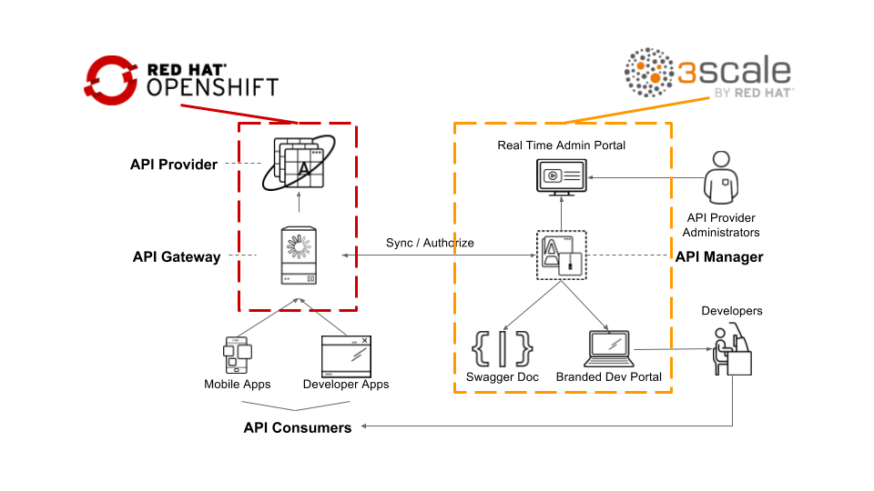
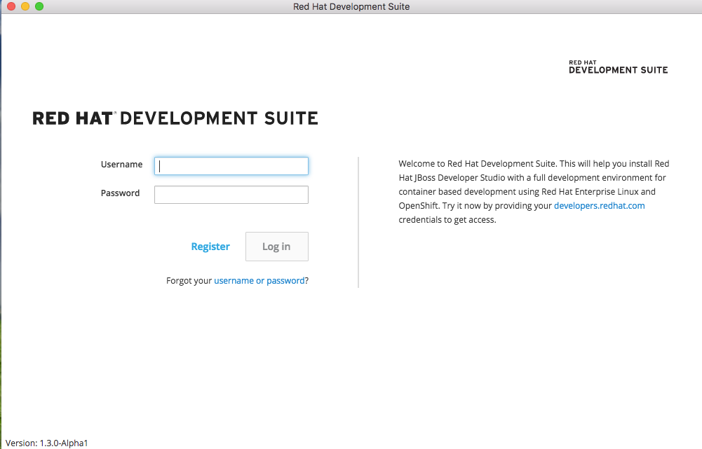
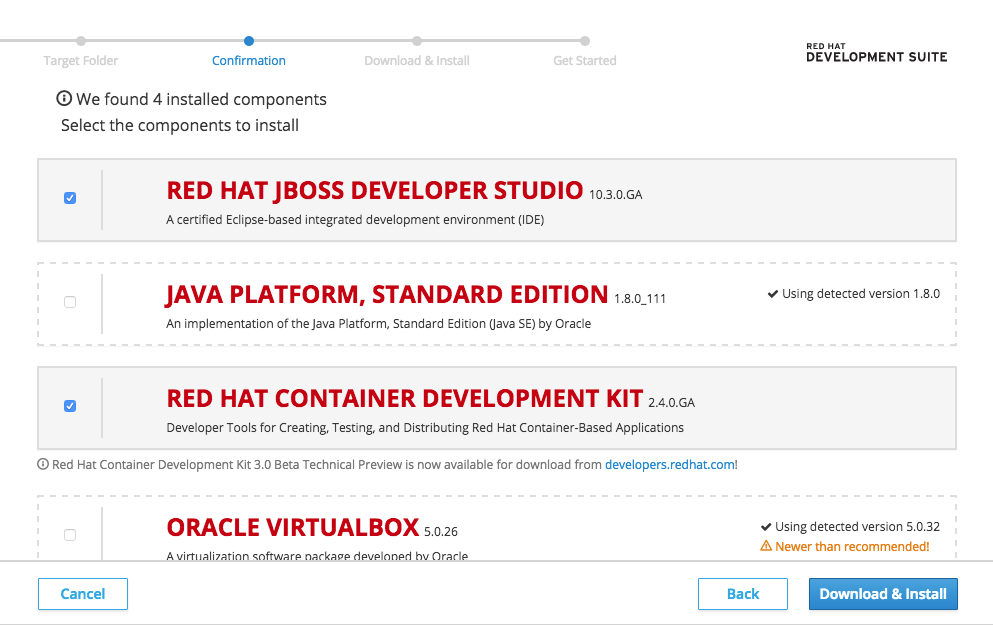
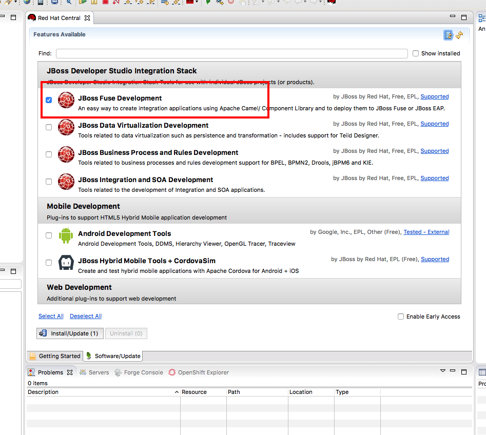
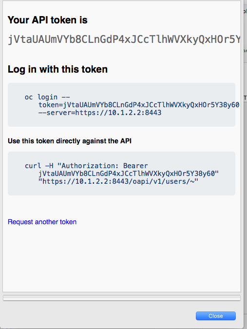
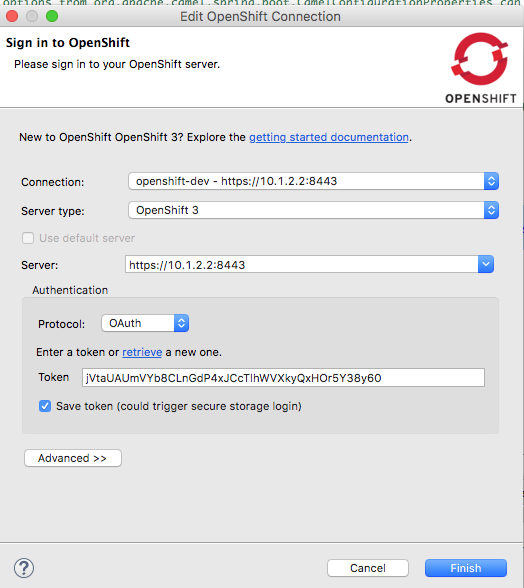

# Red Hat Agile API Integration Workshop - Microservices-based Managed API Integration

This very simple lab will guide you to create your very first Fuse-based SpringBoot microservice project running on OpenShift. There are 4 sections in the labs.

* Create a project that read from a database
* Expose a restful API endpoint to access data in the database
* Deploy your application on OpenShift
* Manage and control the access to your API using 3scale

## Red Hat 3scale API Management Platform Account
This lab focuses on the deployment and administration of Red Hat 3Scale. One deployment topology available is known as a *hybrid* approach. A *hybrid* Red Hat 3Scale deployment topology is one in which the 3Scale API gateway is self-managed in your own environment. This self-managed API gateway is in two-way communication with the hosted Red Hat 3Scale SaaS API Management Platform (AMP).



The focus of lab 04 of this course is on this hybrid deployment topology. Subsequently, the lab 04 make heavy use of your account in the Red Hat 3Scale SaaS AMP. If you do not have a Red Hat 3Scale SaaS, please register for free trial one at: https://www.3scale.net/signup/.

You will receive an email in your inbox to complete the signup process and activate your account.

## Installation
Before you begin, please make sure the following software are properly installed

* JBoss Development Suite V1.3 (MacOX/Windows), sorry Linux users, you are on your own
	* JBoss Developer Studio 10.3.0.GA with Integration SOA plugin installed
	https://developers.redhat.com/products/devsuite/download/
	* Java Platform, Standard Edition 1.8.0.111
	* Red Hat Container Development Kit 2.4.0.GA
	* Oracle Virtualbox 5.0.26
	* Vagrant 1.8.1

## Installing and setup development environment
Double click on the JBoss Development Suite, log in using your Red Hat Developer Site credentials.



Pick an installation folder destination.
The installer guide will detect the components needed, and guide you through the installation process.

Installed the components with the version specified in the installer and start to download and install.



Immediately after installation, you will be prompted to select a workspace for your developer studio project. Select anything path of your choice.

Once inside Red Hat JBoss Developer Studio, select "Software/Update" tag in the middle panel. Check the "JBoss Fuse Development" box and click on Install/Update button.



Red Hat JBoss Developer Studio will restart.

## Installing and setup Container Development Kit

Under the folder where you installed the Development Suite, you will find a folder named **cdk** go to **${DEVSUITE_INSTALLTION_PATH}/cdk/components/rhel/rhel-ose/** edit file **Vagrantfile**

Find the IMAGE_TAG and configure the OCP version to v3.4, then save the file.

```
#Modify IMAGE_TAG if you need a new OCP version e.g. IMAGE_TAG="v3.3.1.3"
IMAGE_TAG="v3.4"
```

In a command line console, start up your local Openshift

```
vagrant up
```

Install and setup oc binary client

```
vagrant service-manager install-cli openshift
export PATH=${vagrant_dir}/data/service-manager/bin/openshift/1.4.0:$PATH
eval "$(VAGRANT_NO_COLOR=1 vagrant service-manager install-cli openshift  | tr -d '\r')"
```

Login as admin

```
oc login -u admin
Authentication required for https://10.1.2.2:8443 (openshift)
Username: admin
Password:
Login successful.

```

Install Fuse image stream on OpenShift and Database template for this lab

```
#FIS image
oc create -f https://raw.githubusercontent.com/jboss-fuse/application-templates/master/fis-image-streams.json -n openshift

#MYSQL Database
oc create -f https://raw.githubusercontent.com/openshift/origin/master/examples/db-templates/mysql-ephemeral-template.json -n openshift
```

log back in as developer

```
oc login -u openshift-dev
Authentication required for https://10.1.2.2:8443 (openshift)
Username: openshift-dev
Password:
Login successful.

```

Access OpenShift console by going to the following URL in the browser.

```
https://10.1.2.2:8443
```

Going back to Red Hat JBoss Developer Studio, in OpenShift Explorer view, click on **New Connection Wizard..** to configure OpenShift setting
Enter **https://10.1.2.2:8443** as the **Server** and click on the **retrieve** link to access the token.



In the popup window, log in as Developer using ID/PWD openshift-dev/devel. Select ok and check the **Save token** box.



## Windows Users

- Make sure you disable  Hyper-V functionality under Control Panel
- Add _config.ssh.insert\_key=false_ to **Vagrantfile** ${DEVSUITE_INSTALLATION_PATH}/cdk/components/rhel/rhel-ose/

Thanks to @sigreen

## FAQ
- How to install Maven?  
	- Go to https://maven.apache.org/install.html for detail instructions
- Maven dependency not found?
	- ${MAVEN_INSTALLED_DIR} if you are having trouble downloading from the repositories
