Lab two - APIs
====

## Part 1: Creating APIs

To expose a HTTP API endpoint, we first have to inject a Servlet into Camel context, go to **camel-context.xml** file under **Camel Contexts**, open the *source* tab, add the following code snippet before the `<camelContext..>` tag.

```
    ...
    <bean class="org.apache.camel.component.servlet.CamelHttpTransportServlet" id="camelHttpTransportServlet"/>
    <bean
        class="org.springframework.boot.web.servlet.ServletRegistrationBean" id="servlet">
        <property name="name" value="CamelServlet"/>
        <property name="servlet" ref="camelHttpTransportServlet"/>
        <property name="urlMappings" value="/myfuselab/*"/>
    </bean>
    ...
```

In the same file, under the `<camelcontext..>` tag add the following code snippet to configure the REST endpoint. So that it is now using the Servlet we have injected from last step

```
    ...
       <restConfiguration apiContextPath="api-docs" bindingMode="json"
            component="servlet" contextPath="/myfuselab">
            <apiProperty key="cors" value="true"/>
            <apiProperty key="api.title" value="My First Camel API Lab"/>
            <apiProperty key="api.version" value="1.0.0"/>
        </restConfiguration>
	<route id="customers">
    ...
```

We are now going to expose a single API endpoint, right after the **restConfiguration** add

```
    ...
        <rest path="/customer">
            <get uri="all">
            	<description>Retrieve all customer data</description>
                <to uri="direct:getallcustomer"/>
            </get>
        </rest>
    ...
```

Now, instead of trigger the database select with a timer, we are going to trigger it by the API call. In your Camel route, replace the **Timer** with **Direct** component.

replace

```
<from id="time1" uri="timer:timerName?repeatCount=1"/>
```

with

```
<from id="direct1" uri="direct:getallcustomer"/>
```

Next up, we are going to add all the dependencies needed to the maven **pom.xml** file

```
    <dependency>
      <groupId>org.springframework.boot</groupId>
      <artifactId>spring-boot-starter-web</artifactId>
    </dependency>
    <dependency>
      <groupId>org.apache.camel</groupId>
      <artifactId>camel-servlet-starter</artifactId>
    </dependency>
    <dependency>
      <groupId>org.apache.camel</groupId>
      <artifactId>camel-jackson-starter</artifactId>
    </dependency>
    <dependency>
      <groupId>org.apache.camel</groupId>
      <artifactId>camel-swagger-java-starter</artifactId>
    </dependency>
```

Right click on the **myfuselab** in the project explorer panel, select **Run As..** -> **Maven build** to start up the Camel application again. And run the following command in your command line console.

```
curl -i http://localhost:8080/myfuselab/customer/all
```

Verify that it is returning a list of customer data in JSON format

```
[{"CUSTOMERID":"A01","VIPSTATUS":"Diamond","BALANCE":1000},{"CUSTOMERID":"A02","VIPSTATUS":"Gold","BALANCE":500}]
```

Stop the application, Try add another API endpoints which takes in the Customer ID and return the customer data matching the ID.

To display swagger documentation,

```
curl -i http://localhost:8080/myfuselab/api-docs
```

#### HINT!

* Add a new REST endpoint that takes in customerid and calls the new camel route we just created.
	* uri="{custid}"
* Add a new Camel route that takes in customerid as paramter
	* select * from customerdemo where customerID=:#custid

Verify with Swagger doc and test the API make sure it is returning customer A01's data in JSON format

```
curl -i http://localhost:8080/myfuselab/api-docs
curl -i http://localhost:8080/myfuselab/customer/A01
```

```
[{"CUSTOMERID":"A01","VIPSTATUS":"Diamond","BALANCE":1000}]
```

## Part 2: API Management

#### Connecting your Customers API to 3scale

In order to connect your Customers API to 3scale, you need to follow three simple steps:

1. Access your 3scale Admin Portal and set up your first plans and metrics and your first API keys.
1. Configure API access policy and application plans.
1. Integrate your API with 3scale using the API gateway in the staging environment (for development only).

#### Review Pre-Reqs

Before provisioning an on-premise API gateway environment, you will want to check on the following regarding your 3scale SaaS account :

1. 3scale Domain
    * You should know what the domain name is of your 3scale SaaS accoount is.

    * The name of your 3scale domain is referenced in the URL to your Administrative Portal of the 3scale SaaS environment. ie: https://&lt;YOURDOMAIN&gt;-admin.3scale.net/p/admin/dashboard.

1. 3scale Access Token
    * To get an Access Token, you can easily create one by navigating to:

        `Gear Icon in top right corner -> Personal Settings -> Tokens -> Add Access Token`

        

        

        

        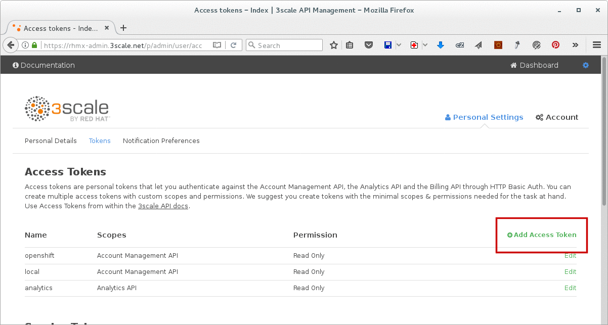

    + The scope of your access token should be: *Account Management API*.

    * Also ensure that your access token has *Read Only* permissions.

        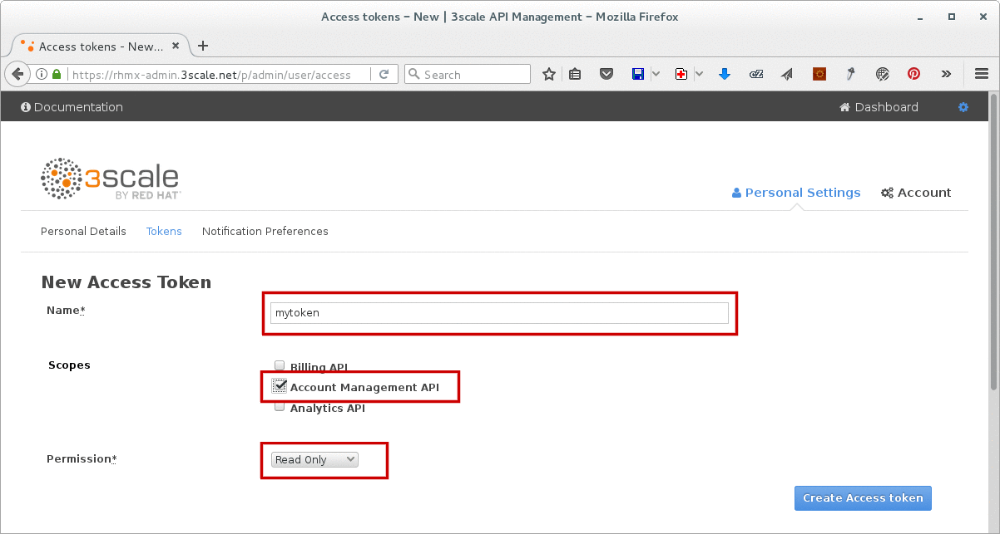

    **Note: Don't forget to copy your token into a safe place as this is the only point where you'll be able to view it. If you fail to do so, you can always create a new access token.**

#### Step 1: Define your API

Your 3scale Admin Portal (http://&lt;YOURDOMAIN&gt;-admin.3scale.net) provides access to a number of configuration features.

1. Login into the Admin Portal:

    

1. The first page you will land is the API tab. From here we will create our API definition. Select the `Create Service` option.

    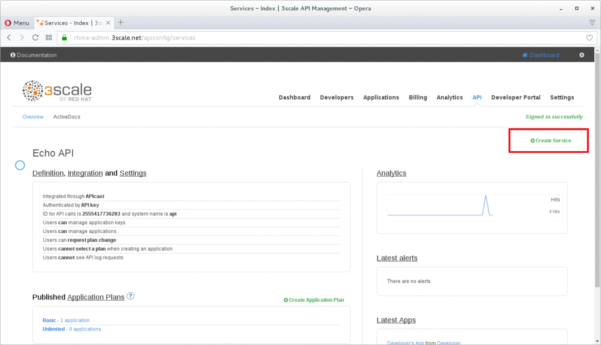

1. Fill in the information for your API. Name it `Customers API` and `customers` for the system name. Add your personal description.

    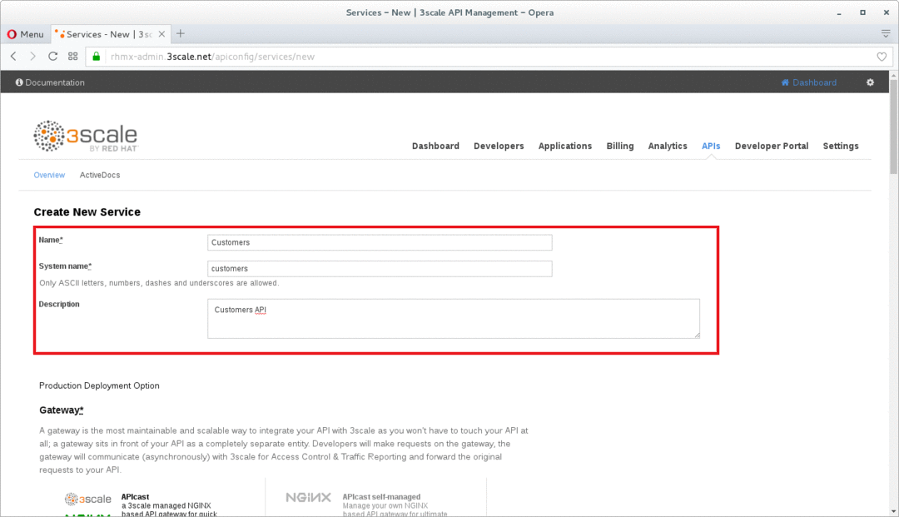

1. Select the **APIcast self-managed** Gateway deployment option.

    

1. Keep the **API Key (user_key)** Authentication.

    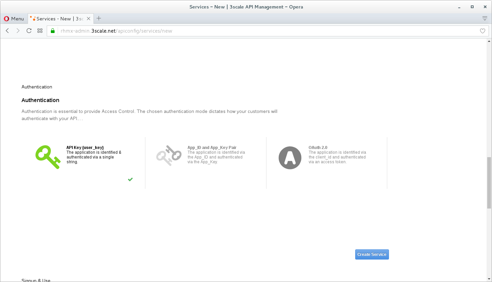

1. Click on **Create Service**
1. Select your new API and click on **Configure Self-managed Gateway**

    

1. Click on the **add the Base URL of your API and save the configuration** button
1. Fill in the information for accessing your API.

    The private Base URL is the camel servlet and default port `<HOST-SERVER-IP>:8080`.

    For this lab, we are going to use the route from the APIcast Gateway deployed on Openshift: `http://customer-api-staging.<OPENSHIFT-SERVER-IP>.nip.io:80` for staging and `http://customer-api-production.<OPENSHIFT-SERVER-IP>.nip.io:80` for production.

    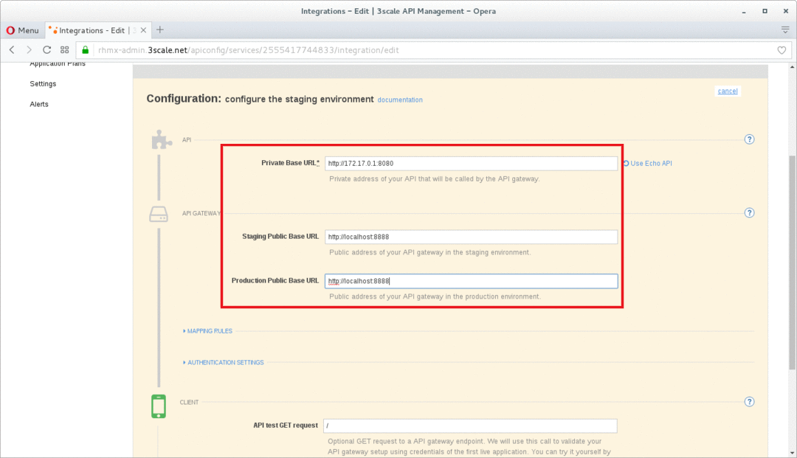

1. Expand the **mapping rules** section to define the allowed methods on our exposed API.

    **Note:** the default mapping is the root ("/") of our API resources, something that we might want to avoid.

    

1. Click on the **Metric or Method (Define)**  link.

    

1. Click on the **New Method** link in the *Methods* section.

    

1. Fill in the information for your Fuse Method.

    **Friendly name:** `Get Customers`

    **System name:** `customers_all`

    **Description:** `Method to return all customers`

    

1. Click on **Create Method**

1. **Optional:** Add the *Get Customer* method if you followed the instructions in the previous part of this lab to search by {id}.

1. Click on the **Add mapping rule** link

    

1. Click on the edit icon next to the GET mapping rule.

    

1. Enter `/myfuselab/customer/all` as the Pattern.

1. Select `customers_all` as Method.

    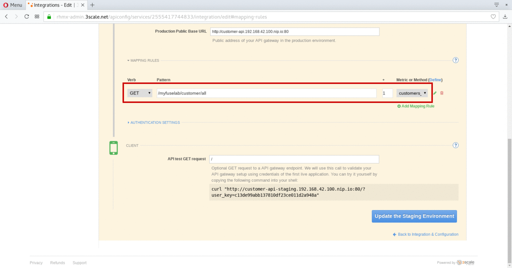

1. *Optional::* Click on the **Add Mapping Rule** button to add the `Get Customer` method mapping.

1. Scroll down to the **API Test GET request**.

1. Enter `/myfuselab/customer/all`.

1. Click on the **Update the Staging Environment** to save the changes and thenk click on the **Back to Integration & Configuration** link.

    

1. Success! Your 3scale access control layer will now only allow authenticated calls through to your backend API.

#### Step 2: Configure your API access policies with application plans

In the previous step, you ensured that only authenticated calls are allowed through to your API. Now you will apply policies to differentiate rate limits.

In 3scale terms, *applications* define the credentials to access your API. An application is always associated with one *application plan*, which determines the access policies. Applications are stored within *developer accounts* – in the basic 3scale plans only a single application is allowed, but in the higher plans multiple applications per account are allowed.

1. Let's create a new application plan for this example. In order to do this, navigate to the **Application Plans** tab and click on **Create Application Plan**.

    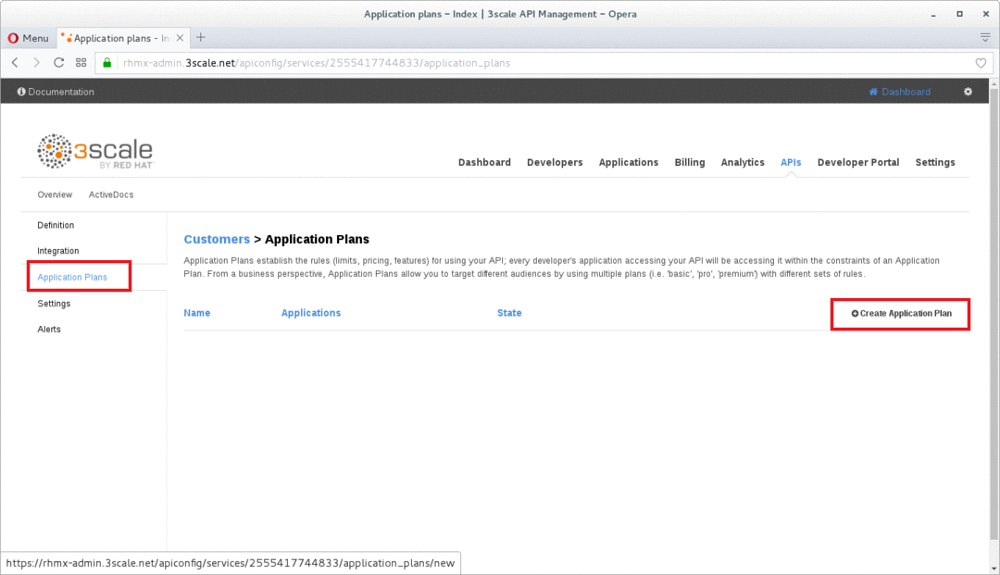

1. Fill in the information for the name of your plan. In the form that opens, specify the desired name – for example "limited" – and the system name. Then click on **Create Application Plan** button.

    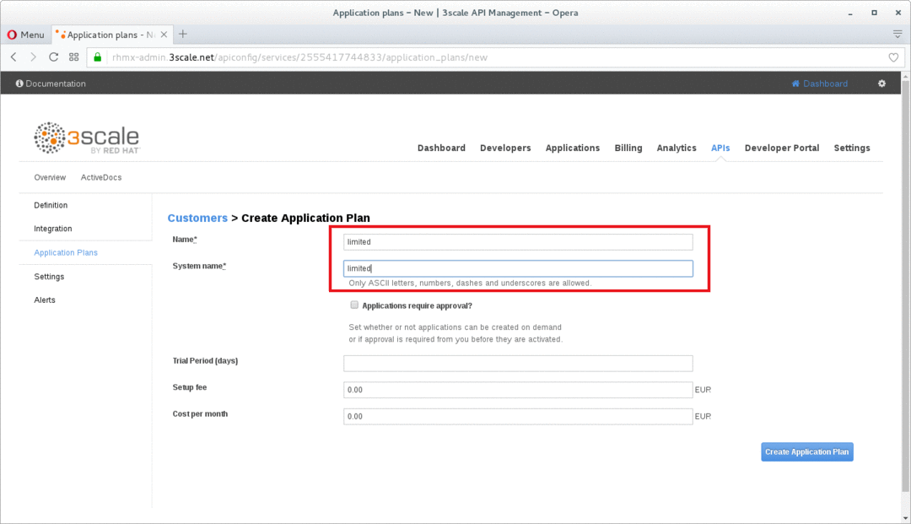

    After the previous step, you should see the list of application plans.

1. Your plan is created, now you need you to publish it. Click on the `publish` link to made it public.

    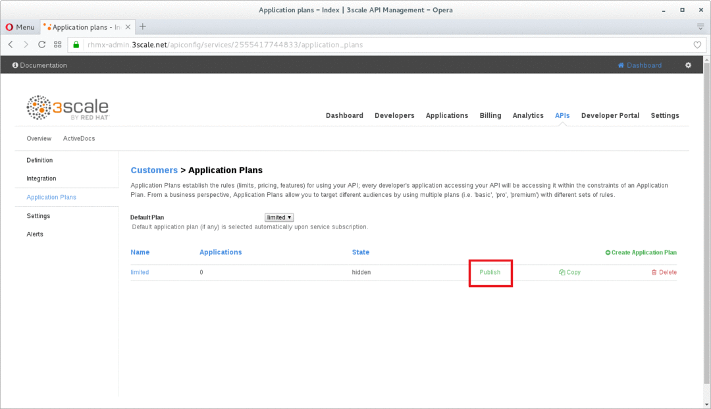

1. To asociate the application plan with an application, navigate to the **Developers** tab and click on the `Developer` link.

    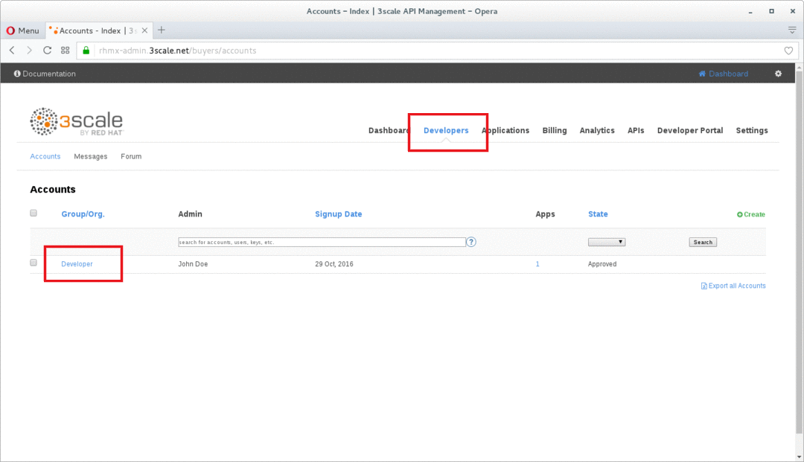

1. Click on the `1 Application` link to access this developer's applications.

    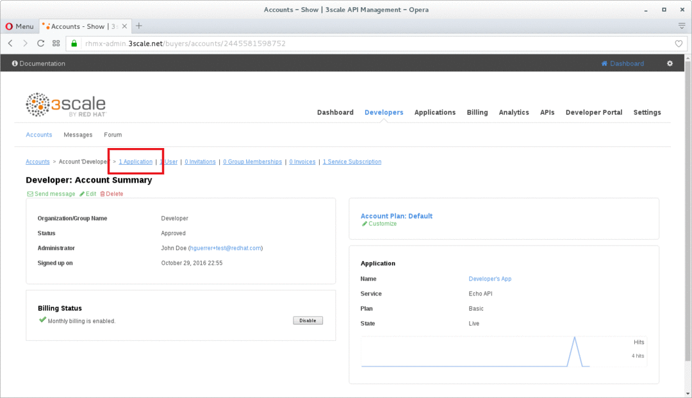

1. Now, create a new Application by clicking the **Create Application** button.

    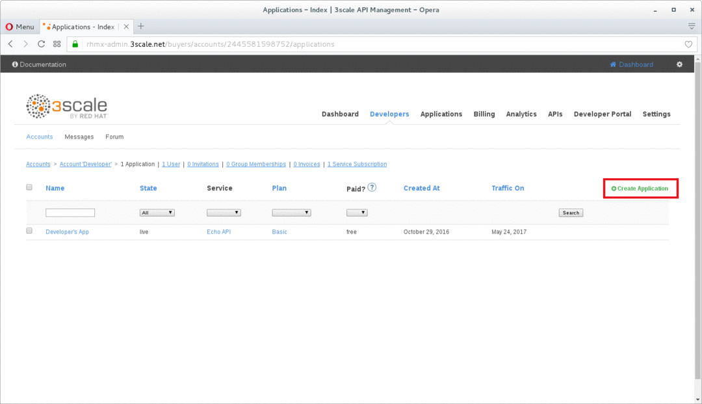

1. Select the previously created application plan from the combobox and fill in the information for the application. Click on the **Create Application** to save your changes.

    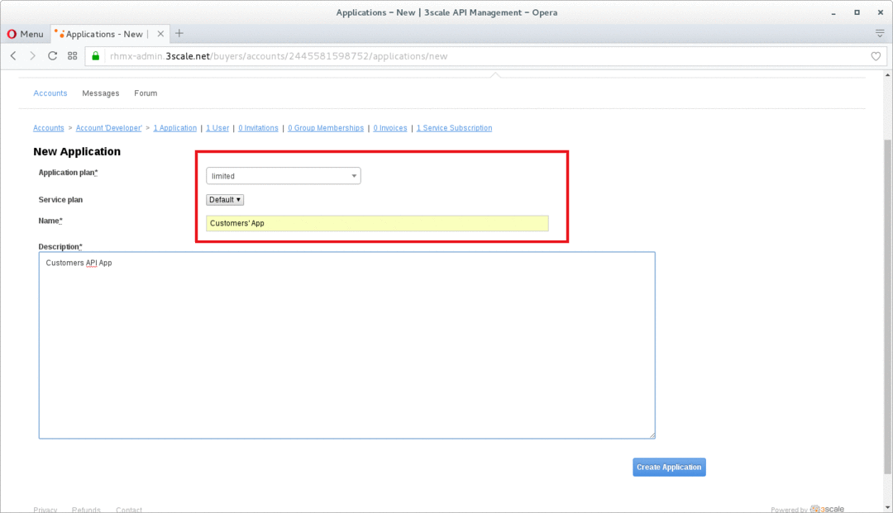

1. In the next screen, you will be presented with the autogenerated user key that will be used to access your API.

    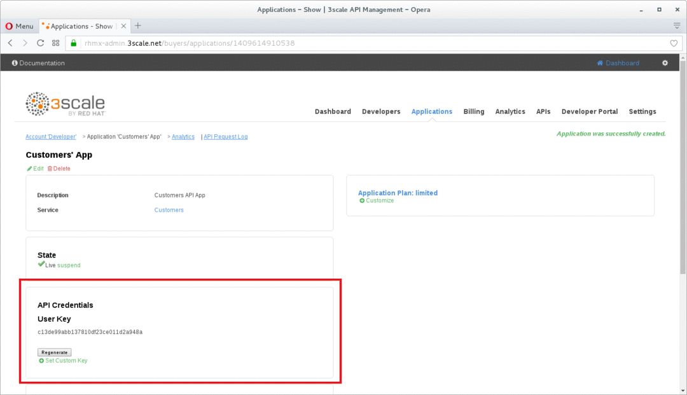


#### Step 3: Deploy APIcast using the OpenShift template


1. By default you are logged in as *developer* and can proceed to the next step.

    Otherwise login into OpenShift using the `oc login` command from the OpenShift Client tools you downloaded and installed in the previous step. The default login credentials are *username = "developer"* and *password = "developer"*:

    ```
    oc login https://<OPENSHIFT-SERVER-IP>:8443
    ```

    You should see Login successful. in the output.

2. Create your project. This example sets the display name as *gateway*

    ```
    oc new-project "3scalegateway" --display-name="gateway" --description="3scale gateway demo"
    ```

    The response should look like this:

    ```
    Now using project "3scalegateway" on server "https://172.30.0.112:8443".
    ```

    Ignore the suggested next steps in the text output at the command prompt and proceed to the next step below.

1. Create a new Secret to reference your project by replacing and with yours.

    ```
    oc secret new-basicauth apicast-configuration-url-secret --password=https://<ACCESS_TOKEN>@<DOMAIN>-admin.3scale.net
    ```

    Here **&lt;ACCESS_TOKEN&gt;** is an Access Token (not a Service Token) for the 3scale Account Management API, and **&lt;DOMAIN&gt;-admin.3scale.net** is the URL of your 3scale Admin Portal.

    *You got his access token and domain in the Pre-Reqs section.*

    The response should look like this:

    ```
    secret/apicast-configuration-url-secret
    ```

1. Create an application for your APIcast Gateway from the template, and start the deployment:

    ```
    oc new-app -f https://raw.githubusercontent.com/3scale/3scale-amp-openshift-templates/2.0.0.GA-redhat-2/apicast-gateway/apicast.yml
    ```

    You should see the following messages at the bottom of the output:

    ```
    --> Creating resources ...
      deploymentconfig "apicast" created
      service "apicast" created
    --> Success
      Run 'oc status' to view your app.
    ```

1. Open the web console for your OpenShift cluster in your browser:  https://&lt;OPENSHIFT-SERVER-IP&gt;:8443/console/

    You should see the login screen:

    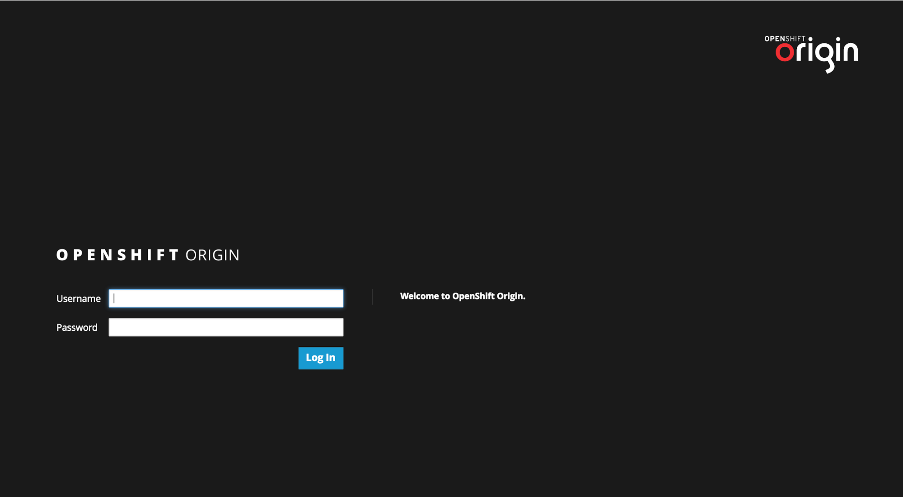

      > **Note:** You may receive a warning about an untrusted web-site. This is expected, as we are trying to access the web console through secure protocol, without having configured a valid certificate. While you should avoid this in production environment, for this test setup you can go ahead and create an exception for this address.

1. Log in using the `developer` credentials in the section above.

    You will see a list of projects, including the *gateway* project you created from the command line above.

    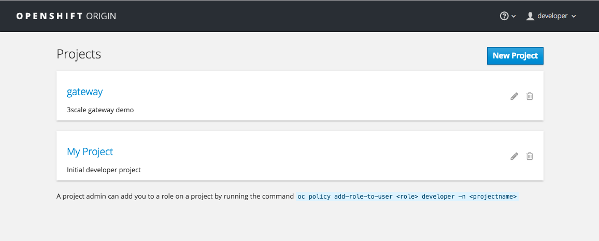

1. Click on *gateway* and you will see the *Overview* tab.

    Each APIcast instance, upon starting, downloads the required configuration from 3scale using the settings you provided on the **Integration** page of your 3scale Admin Portal.

    

1. In order to allow your APIcast instances to receive traffic, you'll need to create a route. Start by clicking on **Create Route**.

    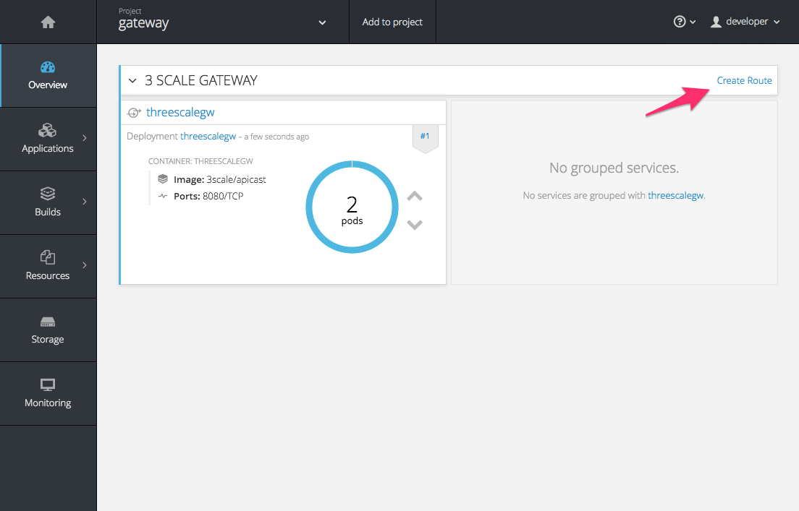

    Enter the same host you set in 3scale above in the section **Public Base URL** (without the http:// and without the port), in this lab: `customer-api-staging.<OPENSHIFT-SERVER-IP>.nip.io`, then click the **Create** button.

    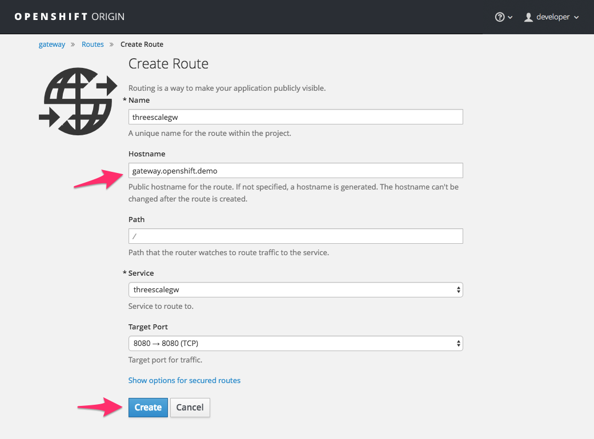

    Your API Gateways are now ready to receive traffic. OpenShift takes care of load-balancing incoming requests to the route across the two running APIcast instances.

    If you wish to see the APIcast logs, you can do so by clicking **Applications > Pods**, selecting one of the pods and finally selecting **Logs**.

#### Step 4: Test APIcast

1. Test that APIcast authorizes a valid call to your API, by executing a curl command with your valid *user_key* to the *hostname* that you configured in the previous step:

    ```
    curl -i "http://customer-api-staging.<OPENSHIFT-SERVER-IP>.nip.io:80/myfuselab/customer/all?user_key=YOUR_USER_KEY" --insecure
    ```
    You should see the following messages:

    ```
    HTTP/1.1 200 OK
    Server: openresty/1.11.2.2
    Date: Tue, 30 May 2017 20:13:33 GMT
    Content-Type: application/json
    Transfer-Encoding: chunked
    X-Application-Context: application:dev
    accept: */*
    breadcrumbId: ID-traveler-laptop-rh-mx-redhat-com-45222-1496169770755-0-16
    forwarded: for=192.168.42.1;host=customer-api-staging.192.168.42.100.nip.io;proto=http
    user-agent: curl/7.29.0
    user_key: c13de99abb137810df23ce011d2a948a
    x-3scale-proxy-secret-token: Shared_secret_sent_from_proxy_to_API_backend_71cfe31d89d8cf53
    x-forwarded-for: 192.168.42.1
    x-forwarded-host: customer-api-staging.192.168.42.100.nip.io
    x-forwarded-port: 80
    x-forwarded-proto: http
    x-real-ip: 172.17.0.1
    Set-Cookie: e286b151c44656235d8bdca6ee183477=e58d9930d57779957bf1695b6c805dcd; path=/; HttpOnly
    Cache-control: private

    [{"CUSTOMERID":"A01","VIPSTATUS":"Diamond","BALANCE":1000},{"CUSTOMERID":"A02","VIPSTATUS":"Gold","BALANCE":500}]
    ```

    The last line is the same output as when calling the API directly.

2. Test that APIcast does not authorize an invalid call to your API.

    ```
    curl -i "http://customer-api-staging.<OPENSHIFT-SERVER-IP>.nip.io:80/myfuselab/customer/all?user_key=INVALID_KEY" --insecure
    ```

    When calling the API endpoint with an invalid key, the following messages appear:

    ```
    HTTP/1.1 403 Forbidden
    Server: openresty/1.11.2.2
    Date: Tue, 30 May 2017 20:17:19 GMT
    Content-Type: text/plain; charset=us-ascii
    Transfer-Encoding: chunked
    Set-Cookie: e286b151c44656235d8bdca6ee183477=e58d9930d57779957bf1695b6c805dcd; path=/; HttpOnly
    ```

    The *HTTP/1.1 403 Forbidden* response code indicates that our user_key was wrong or we don't have permisson to access this API endpoint.

1. You have sucessfully configured 3scale API Management and Gateway to access your API.
