## Lab three - Deploying to OpenShift

###Starting CDK

For Agile Integration Workshop 
Go to your terminal, and type in 

```
oc-cluster up your_name
```

This will start up the Openshift platform in your instance. 

```
$ oc-cluster up yourname
# Using client for ocp v3.5.5.31
[INFO] Created self signed certs. You can avoid self signed certificates warnings by trusting this certificate: /home/ec2-user/.oc/certs/master.server.crt
[INFO] Running a previously created cluster
oc cluster up --version v3.5.5.31 --image registry.access.redhat.com/openshift3/ose --public-hostname 127.0.0.1 --routing-suffix apps.127.0.0.1.nip.io --host-data-dir /home/ec2-user/.oc/profiles/test/data --host-config-dir /home/ec2-user/.oc/profiles/test/config --host-pv-dir /home/ec2-user/.oc/profiles/test/pv --use-existing-config -e TZ=EDT
-- Checking OpenShift client ... OK
-- Checking Docker client ... OK
-- Checking Docker version ... OK
-- Checking for existing OpenShift container ... OK
-- Checking for registry.access.redhat.com/openshift3/ose:v3.5.5.31 image ... OK
-- Checking Docker daemon configuration ... OK
-- Checking for available ports ... 
   WARNING: Binding DNS on port 8053 instead of 53, which may not be resolvable from all clients.
-- Checking type of volume mount ... 
   Using nsenter mounter for OpenShift volumes
-- Creating host directories ... OK
-- Finding server IP ... 
   Using 172.31.28.24 as the server IP
-- Starting OpenShift container ... 
   Starting OpenShift using container 'origin'
   Waiting for API server to start listening
   OpenShift server started
-- Removing temporary directory ... OK
-- Checking container networking ... OK
-- Server Information ... 
   OpenShift server started.
   The server is accessible via web console at:
       https://127.0.0.1:8443

   To login as administrator:
       oc login -u system:admin

-- Permissions on profile dir fixed
Switched to context "test".
```
You can try view the OpenShift console by going to https://127.0.0.1:8443/console in the browser. 
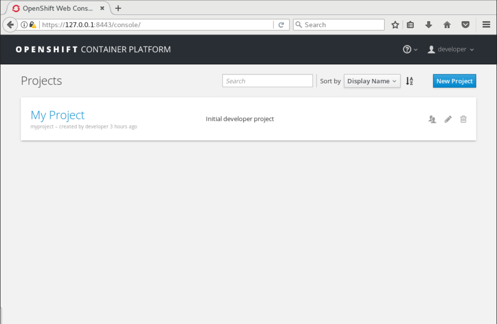


Now it's time to deploy the application onto OpenShift, we have been testing with the H2 Database in memeory, now it's time to run it with a real database. Add the following datasource setting under *src/main/resources* in **application.properties**

```
#mysql specific
mysql.service.name=mysql
mysql.service.database=sampledb
mysql.service.username=dbuser
mysql.service.password=password

#Database configuration
spring.datasource.url = jdbc:mysql://${${mysql.service.name}.service.host}:${${mysql.service.name}.service.port}/${mysql.service.database}
spring.datasource.username = ${mysql.service.username}
spring.datasource.password = ${mysql.service.password}
```

Since we will be using MYSQL database, add the driver dependency in **pom.xml**

```
<dependency>
      <groupId>org.springframework.boot</groupId>
      <artifactId>spring-boot-starter-jdbc</artifactId>
</dependency>
<dependency>
      <groupId>mysql</groupId>
      <artifactId>mysql-connector-java</artifactId>
      <scope>runtime</scope>
</dependency>
```


Open OpenShift Explorer view, on the top menu select window -> Show view -> others. a window will popup. Type openshift in the search field. And select OpenShift Explorer
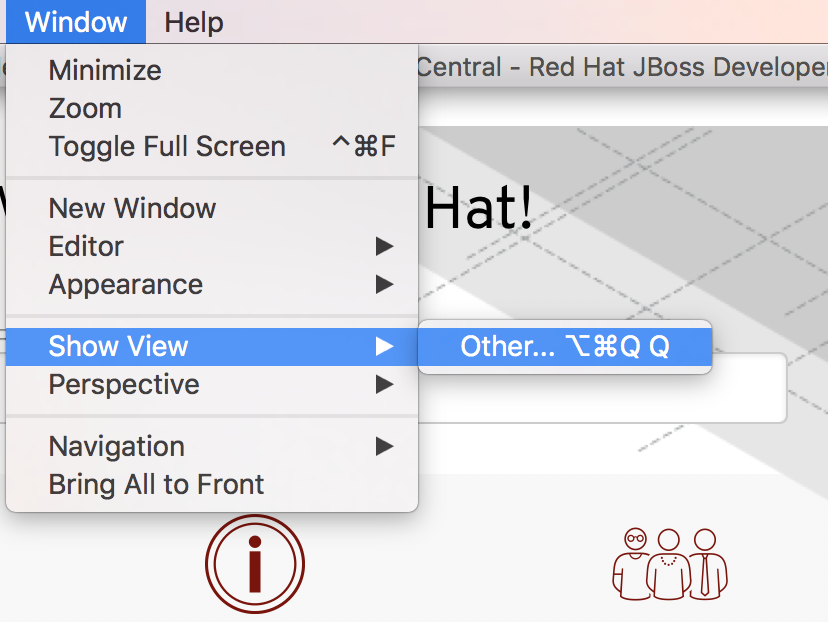
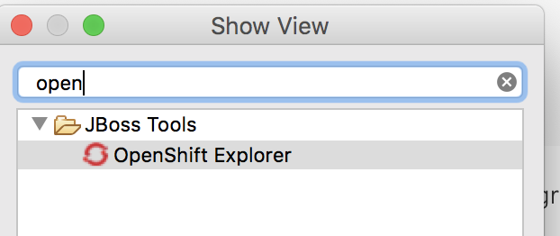

In OpenShift Explorer, right click on the connection that connects to current OpenShift, and create a new project. **NEW** -> **Project**

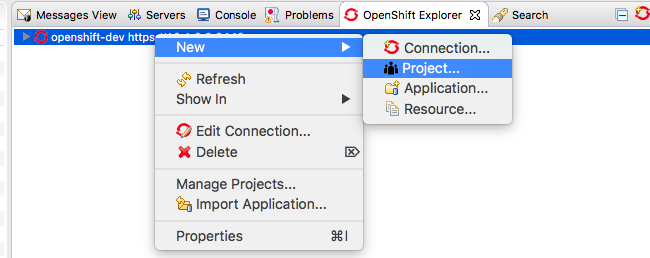

And create Project Name: **myfuseproject** with Display Namw: **My Fuse Project**

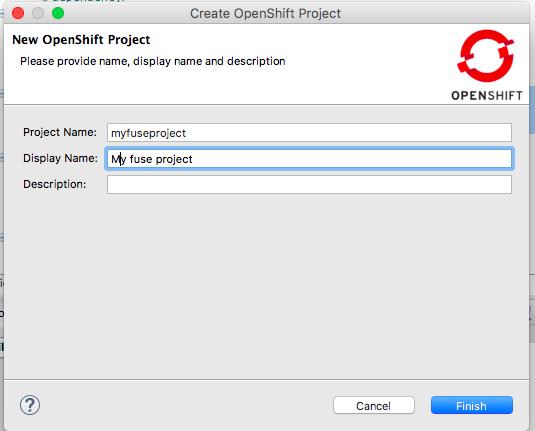

In side the project we are going to first create a MYSQL database for our appkication, right click on the new project name **myfuseproject** -> **New** -> **Application**

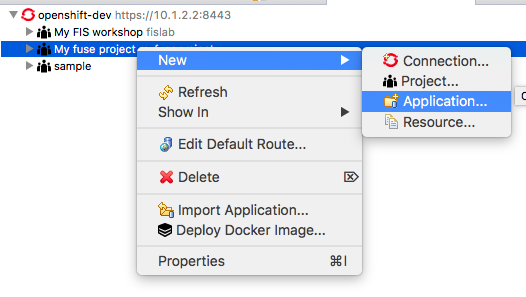

Under Server application source, select **mysql-ephemeral(database, mysql) - openshift** and click next.

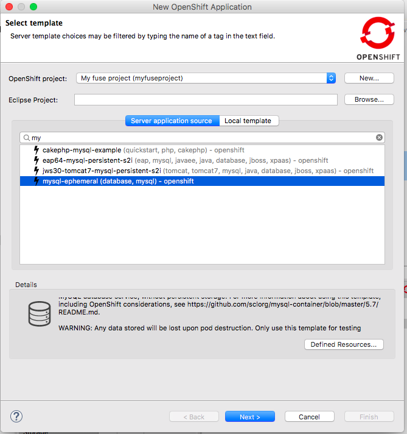

Make sure to configure the following parameters

```
MYSQL_PASSWORD = password
MYSQL_USER = dbuser
```
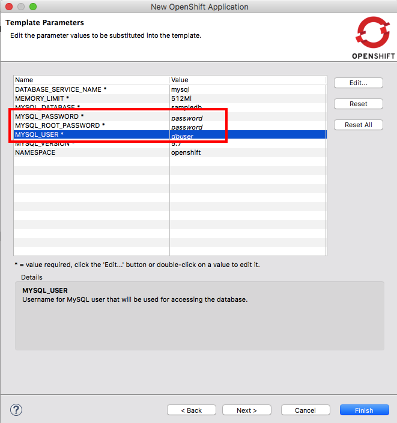

Click Finish, and you should see the mysql instance running in OpenShift explorer.

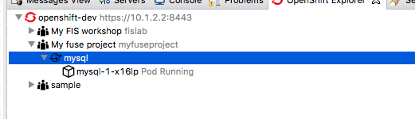

Now we can finally push our application to OpenShift by right click on your project in project explorer. Select **Run As** -> **Run Configurations...**

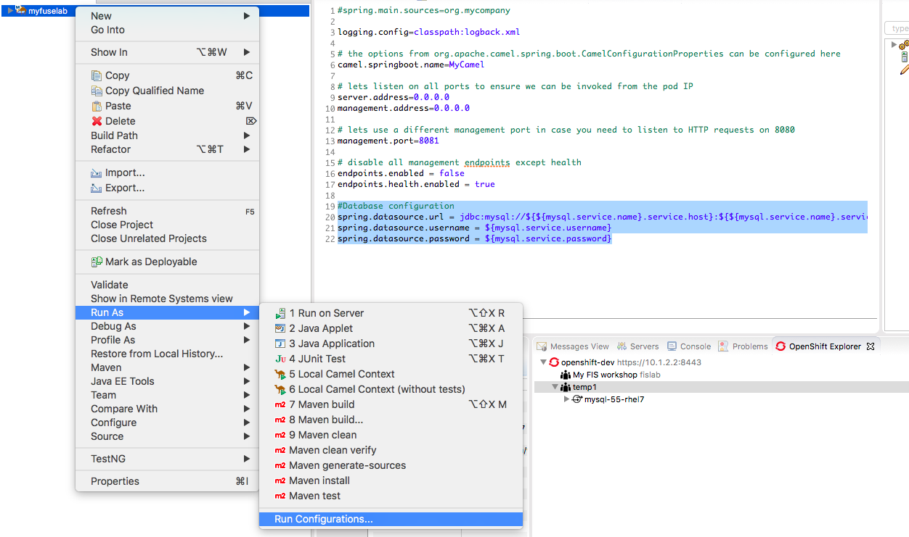

In the pop-up menu, select **Deploy myfuselab on OpenShift** on the left panel. Go to  **JRE** tab on the right, inside VM arguments, update kuberenets.namespace to **myfuseproject** and username/password to **openshif-dev/devel**. And **RUN**.

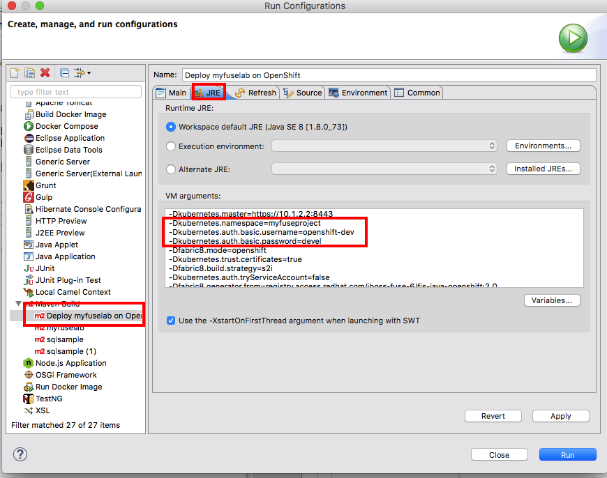

To see everything running, in your browser, go to *https://<OPENSHIFT_IP>:8443/console* and login with **<ID>/<password>** (for people using *oc cluster up or wrapper, it's developler/developer*). Select **My Fuse Project**. And you will see both application in the overview page.

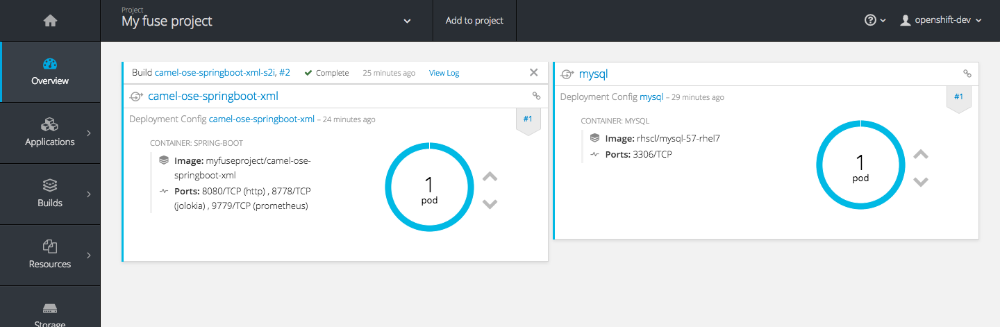

To access the service outside OpenShift, go to **Application** -> **Service** on the left menu, and click **camel-ose-springboot-xml** in the service page.

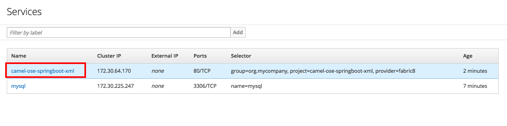

Click on **Create route**.

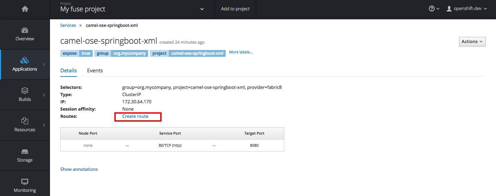

Don't change anything and hit Create.

Access the API endpoint by going to following URL

```
curl http://<YOUR_ROUTE>/myfuselab/customer/all
curl  http://<YOUR_ROUTE>/myfuselab/customer/A01
```

Verify that it is returning customer data in JSON format
```
[{"CUSTOMERID":"A01","VIPSTATUS":"Diamond","BALANCE":1000},{"CUSTOMERID":"A02","VIPSTATUS":"Gold","BALANCE":500}]

[{"CUSTOMERID":"A01","VIPSTATUS":"Diamond","BALANCE":1000}]
```
To see the Camel route in action, in your OpenShift console, go to **Application** -> **pod** and select the first **camel-ose-springboot-xml-1-xxxxx** pod.

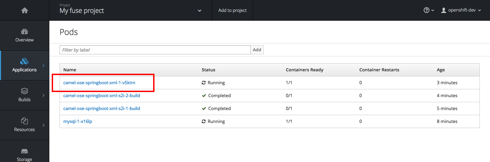

Click **Open Java Console**, and it's going to take you to the indiviual console that show how your Camel route is doing.

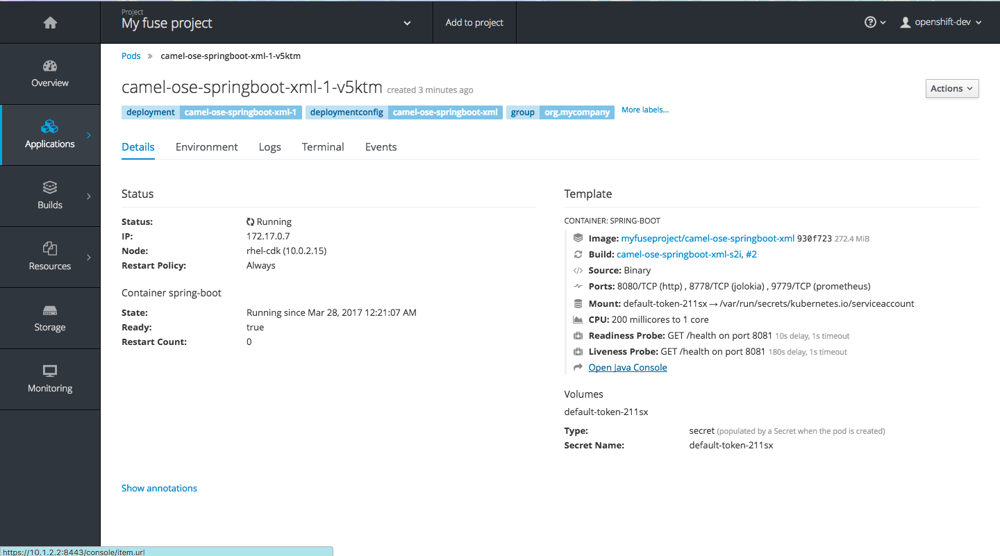

Click on **Route Diagram** and hit the URL couple of times to see what happens.

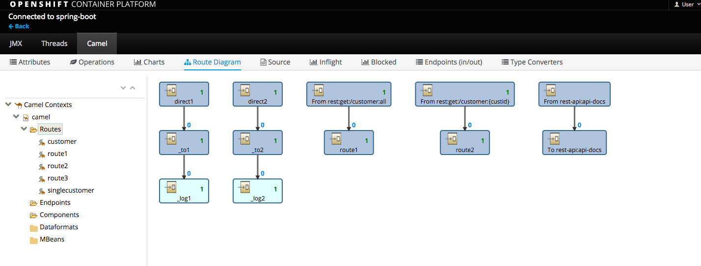

For those of you who wants to see what is going on in database, login to the MYSQL database in your command line console.

```
oc project myfuseproject

oc get pods
NAME                                   READY     STATUS    RESTARTS   AGE
camel-ose-springboot-xml-s2i-1-build   1/1       Running   0          15s
mysql-1-xxxxx                          1/1       Running   0          2m

oc rsh mysql-1-xxxxx

sh-4.2$ mysql -udbuser -p sampledb
Enter password: 

mysql> select * from customerdemo;
+------------+-----------+---------+
| customerID | vipStatus | balance |
+------------+-----------+---------+
| A01        | Diamond   |    1000 |
| A02        | Gold      |     500 |
+------------+-----------+---------+
2 rows in set (0.00 sec)
```