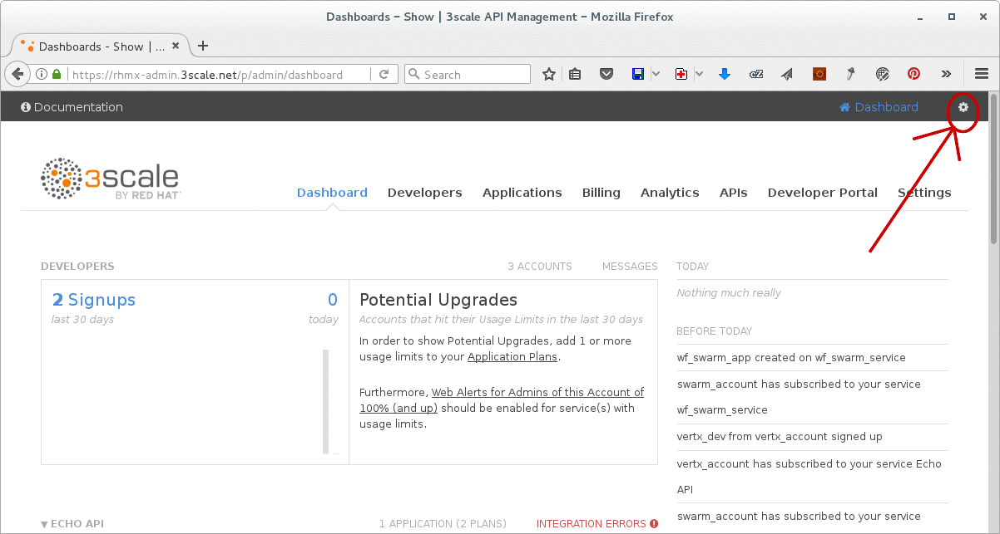
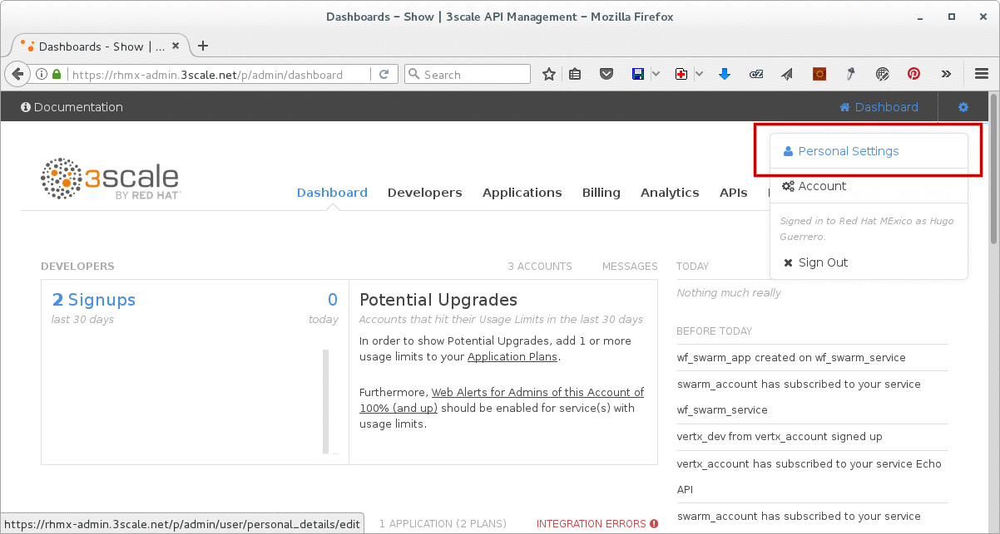
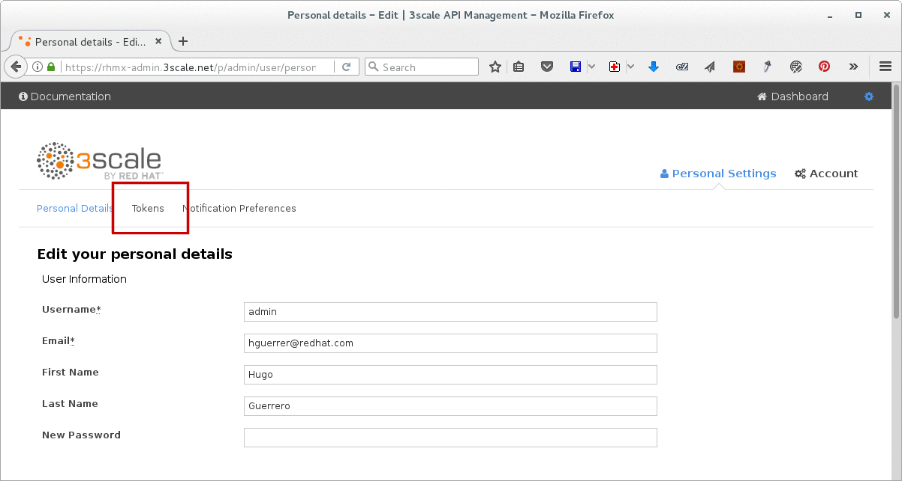
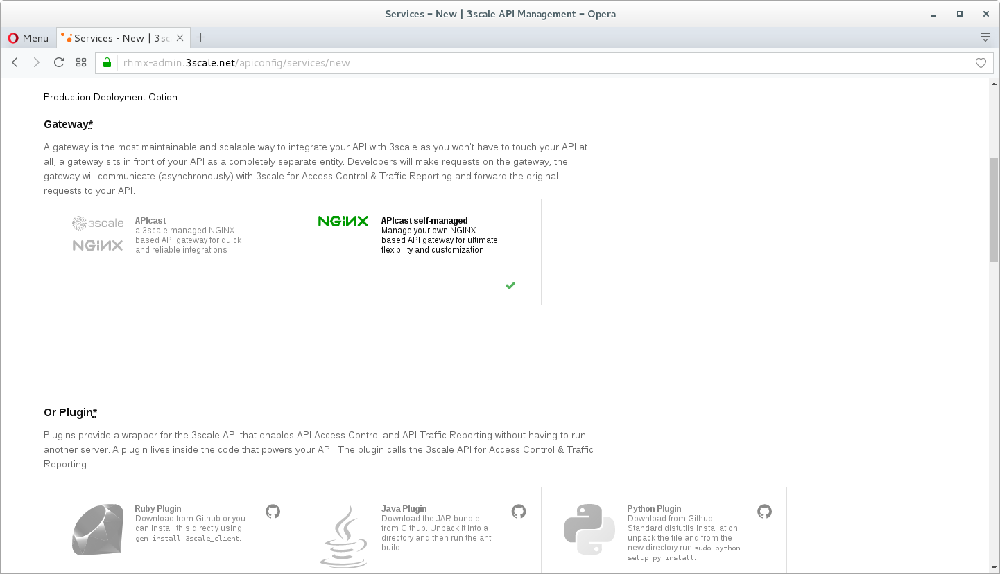
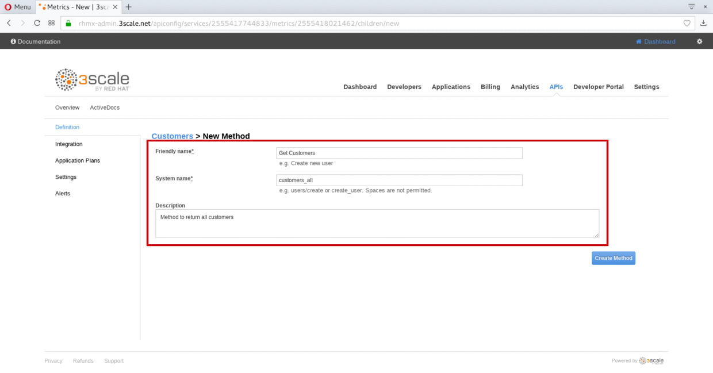
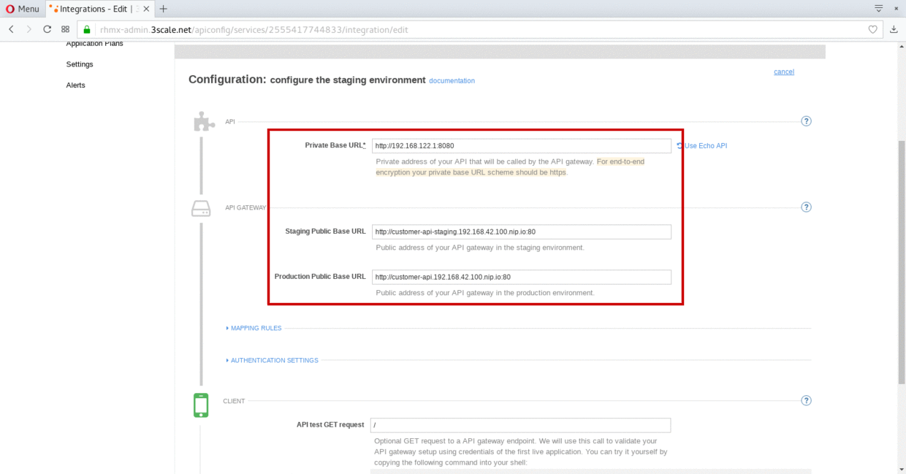
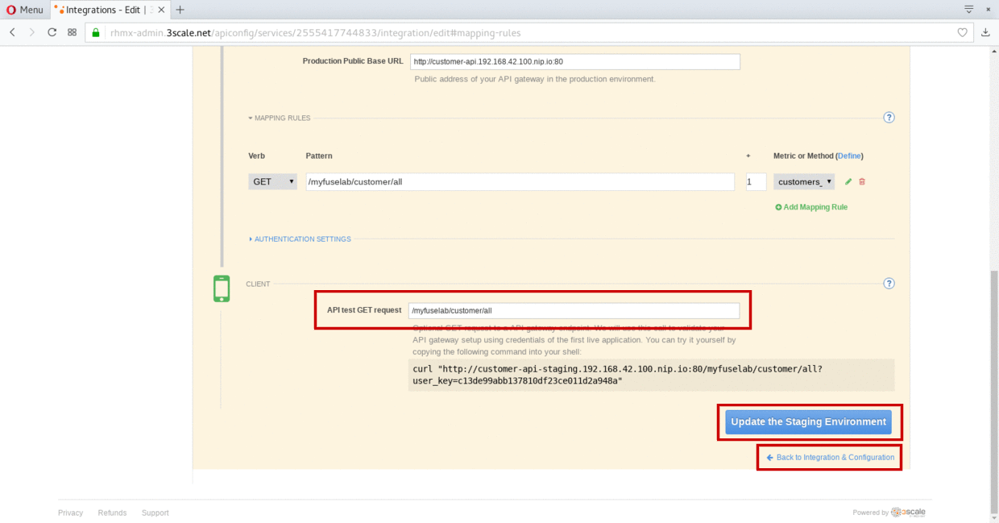
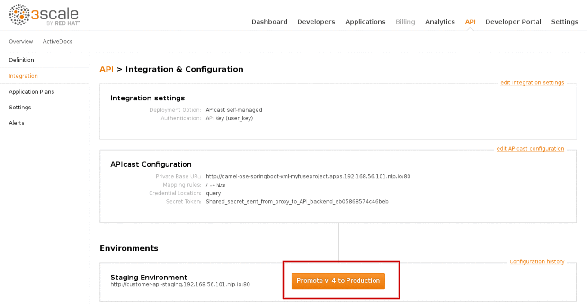

Lab four - API Management
===

### Connecting your Customers API to 3scale API Management

In order to connect your Customers API to 3scale, you need to follow three simple steps:

1. Access your 3scale Admin Portal and set up your first service.
1. Customize your Developer Portal and sign up as a developer.
1. Integrate your API with 3scale using the API gateway.

### Step 0: Review Pre-Reqs

Before provisioning an on-premise API gateway environment, you will want to check on the following regarding your 3scale SaaS account :

1. 3scale Domain
    * You should know what the domain name is of your 3scale SaaS accoount is.

    * The name of your 3scale domain is referenced in the URL to your Administrative Portal of the 3scale SaaS environment. ie: https://&lt;YOURDOMAIN&gt;-admin.3scale.net/p/admin/dashboard.

1. 3scale Access Token
    * To get an Access Token, you can easily create one by navigating to:

        `Gear Icon in top right corner -> Personal Settings -> Tokens -> Add Access Token`

        

        

        

        

    + The scope of your access token should be: *Account Management API*.

    * Also ensure that your access token has *Read Only* permissions.

        

    > **Note:** Don't forget to copy your token into a safe place as this is the only point where you'll be able to view it. If you fail to do so, you can always create a new access token.
    
### Step 1: Deploy APIcast using the OpenShift template


1. By default you are logged in as *developer* and can proceed to the next step.

    Otherwise login into OpenShift using the `oc login` command from the OpenShift Client tools you downloaded and installed in the previous step. The default login credentials are *username = "developer"* and *password = "developer"*:

    ```
    oc login https://<OPENSHIFT-SERVER-IP>:8443 -u developer
    ```

    You should see Login successful. in the output.

2. Create a new secret to reference your admin portal configuration.

    ```
    oc secret new-basicauth apicast-configuration-url-secret --password=https://<ACCESS_TOKEN>@<DOMAIN>-admin.3scale.net
    ```

    Here **&lt;ACCESS_TOKEN&gt;** is an Access Token (not a Service Token) for the 3scale Account Management API, and **&lt;DOMAIN&gt;-admin.3scale.net** is the URL of your 3scale Admin Portal.

    > **Note:** You got this access token and domain in the Pre-Reqs section.

    The response should look like this:

    ```
    secret/apicast-configuration-url-secret
    ```

3. Create an application for your APIcast Gateway from the template, and start the deployment:

    ```
    oc new-app -f https://raw.githubusercontent.com/3scale/3scale-amp-openshift-templates/2.0.0.GA-redhat-2/apicast-gateway/apicast.yml
    ```

    You should see the following messages at the bottom of the output:

    ```
    --> Creating resources ...
      deploymentconfig "apicast" created
      service "apicast" created
    --> Success
      Run 'oc status' to view your app.
    ```


4. In *myfuseproject* and you will see the *Overview* tab.

    Each APIcast instance, upon starting, downloads the required configuration from 3scale using the settings you provided on the **Integration** page of your 3scale Admin Portal. In order to allow your APIcast instances to receive traffic, you'll need to create a route. Start by clicking on **Create Route**.

    

    Enter the same host you set in 3scale above in the section **Staging Public Base URL** (without the http:// and without the port), in this lab's step 1: `customer-api-staging.<OPENSHIFT-SERVER-IP>.nip.io`, then click the **Create** button.

    

1. Now add the production route. This time select `Applications -> Routes` from the left options.

    

1. Click on the `Create Route` button.

    

1. Fill in the information.

    **Name:** `apicast-production`

    **Hostname:** `customer-api-production.<OPENSHIFT-SERVER-IP>.nip.io`

    

1. Click on the `Create` button in the botton of the page to save the production route.

    Your API Gateways are now ready to receive traffic. OpenShift takes care of load-balancing incoming requests to the route across the two running APIcast instances.

    If you wish to see the APIcast logs, you can do so by clicking **Applications > Pods**, selecting one of the pods and finally selecting **Logs**.


### Step 2: Define your API

Your 3scale Admin Portal (http://&lt;YOURDOMAIN&gt;-admin.3scale.net) provides access to a number of configuration features.

1. Login into the Admin Portal:

    

2. If it's the first time you access the 3scale portal, like when you click the *activate* link from the sign up email, dismiss and close the wizard by clicking on the top right **X**.

    

3. The first page you will land is the API tab. From here we will create our API definition. Click on the `Integration` link.

    

4. Click on the `edit integration settings` to edit the API settings for the gateway.

    

5. Select the **APIcast self-managed** Gateway deployment option.

    

6. Keep the **API Key (user_key)** Authentication.

    

7. Click on **Update Service**

8. Click on the **add the Base URL of your API and save the configuration** button

9. Expand the **mapping rules** section to define the allowed methods on our exposed API.

    > **Note:** the default mapping is the root ("/") of our API resources, something that we might want to avoid.

    

10. Click on the **Metric or Method (Define)**  link.

    

11. Click on the **New Method** link in the *Methods* section.

    

12. Fill in the information for your Fuse Method.

    **Friendly name:** `Get Customers`

    **System name:** `customers_all`

    **Description:** `Method to return all customers`

    

13. Click on **Create Method**

14. **Optional:** Add the `Get Customer` method if you followed the instructions in the previous part of this lab to search by `{id}`. Name it `customer_get`.

15. Click on the **Add mapping rule** link

    

16. Click on the edit icon next to the GET mapping rule.

    

17. Enter `/myfuselab/customer/all` as the Pattern.

18. Select `customers_all` as Method.

    

19. *Optional::* Click on the **Add Mapping Rule** button to add the `customer_get` method mapping.

20. Fill in the information for accessing your API:

    **Private Base URL:** `http://camel-ose-springboot-xml:80`

    **Staging Public Base URL:** `http://customer-api-staging.<OPENSHIFT-SERVER-IP>.nip.io:80`

    **Production Public Base URL:** `http://customer-api-production.<OPENSHIFT-SERVER-IP>.nip.io:80`

    

    > **Note:** We are using the internal API service, as we are deploying our services inside the same OpenShift cluster.

21. Scroll down to the **API Test GET request**.

22. Enter `/myfuselab/customer/all`.

23. Click on the **Update the Staging Environment** to save the changes and then click on the **Back to Integration & Configuration** link.

    

24. Click on the **Promote v.1 to Production** button to promote your configuration from staging to production.

    

25. Success! Your 3scale access control layer will now only allow authenticated calls through to your backend API.

### Step 3: Register a new account using the Developer Portal

The focal point of your developers’ experience is the API developer portal, and the level of effort you put into it will determine the level of decreased support costs and increased developer engagement. 3scale provides a built-in, state-of-the-art CMS portal, making it very easy to create your own branded hub with a custom domain to manage developer interactions and increase API adoption.

You can customize the look and feel of the entire Developer Portal to match your own branding. You have complete control over every element of the portal, so you can make it as easy as possible for developers to learn how to use your API.

The Developer Portal's CMS consists of a few elements:
* Horizontal menu in the Admin Portal with access to content, redirects, and changes
* The main area containing details of the sections above
* CMS mode, accessible through the preview option


Liquid is a simple programming language used for displaying and processing most of the data from the 3scale system available for API providers. In the 3scale platform, it is used to expose server-side data to your API developers, greatly extending the usefulness of the CMS while maintaining a high level of security.

1. Click on the `Developer Portal` tab to access the developer portal settings.

    

1. Click on the `Visit Developer Portal` to take a look of how your developer portal looks like.

    

    You can see there is a default portal with information of your API and how to signup. Unfortunately the API information is incorrect.

    

    > **Note:** We will edit our portal to update it with the correct information and to add the shadowman cool logo.

1. Go back to your admin portal browser tab and search the content sub-sections for the `Layouts `and select the `</> Main layout`

    

1. First look for the `navbar` section of the main HTML. Replace the `{{ provider.name }}` for the shadowman image link:

    ``

    

1. Click on `Publish` button at the bottom of the editor to save the changes and made them available in the site.

    

1. Go back to browse the top of the content sub-sections and find the `Homepage` section.

    

1. Change all the code `Echo` references in the homepage code for `Customer`.

1. Update the API call examples to reflect your real Fuse API calls.

    > **Note:** Use your production base url and add your defined methods. Dont worry if you don't have the "real" output, it won't affect the rest of the lab.

1. Refresh your Developer Portal's browser tab to check the changes. Your Developer Portal should look like this:

    

1. Take the place of one of your developers and signup for the **Basic** plan.

    

1. Fill in your information and your email to register as a developer. Click on the `Sign up` button.

    

    > **Note:** Use an email address you can actually access.

1. Check your email and click on the `activate` link.

    

1. As your portal is not currently public, you will need your portal code to finish the registration. You can get the code in your admin portal navigating to: `Settings > Developer Portal > Domains & Access`.

    

1. Type your portal code to finish the account activation.

    

1. Now that your developer account is active, sign in the portal.

    

1. You will land in the developers homepage, where you will be able to check your developers settings and retrieve your `User Key`.

    

    > **Note:** Copy down this key as it is used to authenticate yourself to the managed API.


### Step 4: Test APIcast

1. Test that APIcast authorizes a valid call to your API, by executing a curl command with your valid developer's `user_key` to the `hostname` that you configured in the previous step:

    ```
    curl -i "http://customer-api-production.<OPENSHIFT-SERVER-IP>.nip.io:80/myfuselab/customer/all?user_key=YOUR_USER_KEY" --insecure
    ```
    You should see the following messages:

    ```
    HTTP/1.1 200 OK
    Server: openresty/1.11.2.2
    Date: Tue, 30 May 2017 20:13:33 GMT
    Content-Type: application/json
    Transfer-Encoding: chunked
    X-Application-Context: application:dev
    accept: */*
    breadcrumbId: ID-traveler-laptop-rh-mx-redhat-com-45222-1496169770755-0-16
    forwarded: for=192.168.42.1;host=customer-api-staging.192.168.42.100.nip.io;proto=http
    user-agent: curl/7.29.0
    user_key: c13de99abb137810df23ce011d2a948a
    x-3scale-proxy-secret-token: Shared_secret_sent_from_proxy_to_API_backend_71cfe31d89d8cf53
    x-forwarded-for: 192.168.42.1
    x-forwarded-host: customer-api-staging.192.168.42.100.nip.io
    x-forwarded-port: 80
    x-forwarded-proto: http
    x-real-ip: 172.17.0.1
    Set-Cookie: e286b151c44656235d8bdca6ee183477=e58d9930d57779957bf1695b6c805dcd; path=/; HttpOnly
    Cache-control: private

    [{"CUSTOMERID":"A01","VIPSTATUS":"Diamond","BALANCE":1000},{"CUSTOMERID":"A02","VIPSTATUS":"Gold","BALANCE":500}]
    ```

    The last line is the same output as when calling the API directly.

2. Test that APIcast does not authorize an invalid call to your API.

    ```
    curl -i "http://customer-api-production.<OPENSHIFT-SERVER-IP>.nip.io:80/myfuselab/customer/all?user_key=INVALID_KEY" --insecure
    ```

    When calling the API endpoint with an invalid key, the following messages appear:

    ```
    HTTP/1.1 403 Forbidden
    Server: openresty/1.11.2.2
    Date: Tue, 30 May 2017 20:17:19 GMT
    Content-Type: text/plain; charset=us-ascii
    Transfer-Encoding: chunked
    Set-Cookie: e286b151c44656235d8bdca6ee183477=e58d9930d57779957bf1695b6c805dcd; path=/; HttpOnly
    ```

    The *HTTP/1.1 403 Forbidden* response code indicates that our user_key was wrong or we don't have permisson to access this API endpoint.

3. You have sucessfully configured 3scale API Management and Gateway to access your API.
