## Lab five - Create your first SpringBoot Fuse Transformer project
In JBoss Developer Studio, create a new project by right click in the project explorer panel, select **New** -> **Fuse Integration Project**

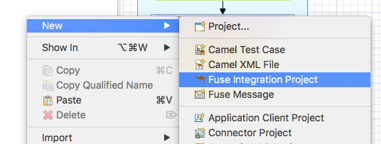

Enter **myfusetransformerlab** as the project name, and click *next*

IMPORTANT NOTE : MUST select **2.18.1.redhat-000012** as the Camel Version!!

In select target runtime, click *next*


In Advance project setup, choose **Use a predefined template** and select **Fuse on OpenShift** -> **SprintBoot on OpenShift** and click *finish*


JBDS is going ask if you want to change to Fuse perspective, click yes. 

Right-click on the *src/* directory and click "New" then "Folder".  Name the folder ** data **.

Right-click on the *src/data* directory, then click "New" then "File".  Call the file **event1.xml**.  Paste the following contents into the File by selecting the "Source" tab.

```
<?xml version="1.0" encoding="UTF-8"?>
<event type="adjustment">
  <stock-id>1</stock-id>
  <stock-name>Bushmaster</stock-name>
  <quantity>15</quantity>
</event>
```
Duplicate the **event1.xml** twice more and call the new files **event2.xml** and **event3.xml** respectively.  Paste the following contents into each file (replacing the existing content):

```
<?xml version="1.0" encoding="UTF-8"?>
<event type="receipt">
  <stock-id>1</stock-id>
  <stock-name>Bushmaster</stock-name>
  <quantity>1</quantity>
</event>
```

and for **event3.xml**:

```
<?xml version="1.0" encoding="UTF-8"?>
<event type="cycle-count">
  <stock-id>1</stock-id>
  <stock-name>Bushmaster</stock-name>
  <quantity>0</quantity>
</event>
```

Right-click on the *src/main/java* folder and select "New" then "Package".  Give the package the name `com.redhat.usecase.one`.

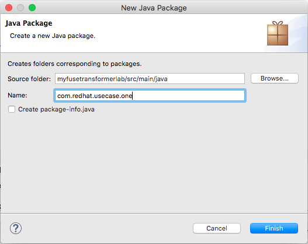

Click "Finish".

Right-click on the newly created `com.redhat.usecase.one` package, click "New" then "Class".  Give the class the name **Event**.  Click "Finish".

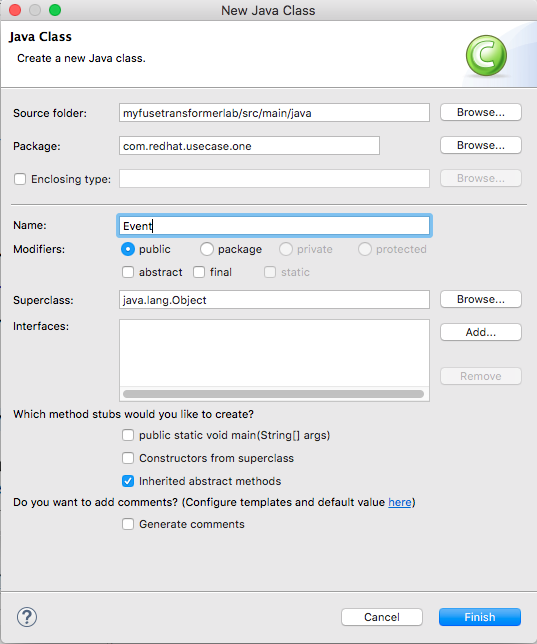

Now we need to create our datamodel for our output CSV file.  For this task, we use a library called camel-bindy.  Replace the contents of Event.java with the below text.  There should be a few errors.  You can ignore them (for now).

```
package com.redhat.usecase.one;

import org.apache.camel.dataformat.bindy.annotation.CsvRecord;
import org.apache.camel.dataformat.bindy.annotation.DataField;

@CsvRecord(separator = ",")
public class Event {

	@DataField(pos = 1)
	private String eventType;
	@DataField(pos = 2)
	private String stockId;
	@DataField(pos = 3)
	private String stockName;
	@DataField(pos = 4)
	private String quantity;

	public String getEventType() {
		return eventType;
	}

	public void setEventType(String eventType) {
		this.eventType = eventType;
	}

	public String getStockId() {
		return stockId;
	}

	public void setStockId(String stockId) {
		this.stockId = stockId;
	}

	public String getStockName() {
		return stockName;
	}

	public void setStockName(String stockName) {
		this.stockName = stockName;
	}

	public String getQuantity() {
		return quantity;
	}

	public void setQuantity(String quantity) {
		this.quantity = quantity;
	}

}
```
To fix up the errors, we need to update our **pom.xml** file with the dependency libraries.  Add the below dependencies, save the file, then the errors in Event.java should disappear.  

```
...
<dependencies>
...
		<dependency>
			<groupId>org.apache.camel</groupId>
			<artifactId>camel-dozer</artifactId>
		</dependency>
		<dependency>
			<groupId>org.apache.camel</groupId>
			<artifactId>camel-bindy</artifactId>
		</dependency>
		<dependency>
			<groupId>org.apache.camel</groupId>
			<artifactId>camel-jaxb</artifactId>
		</dependency>
...
</dependencies>
```

Double click on the **camel-context.xml** file under **Camel Contexts**, you will see the Camel route, delete the simple-route in the canvas.


Create a new route by draging **ROUTE** component from the *Routing* palette on the right. Name the route to **transform-xml-csv** by entering it in the *ID* textbox in the properties section.

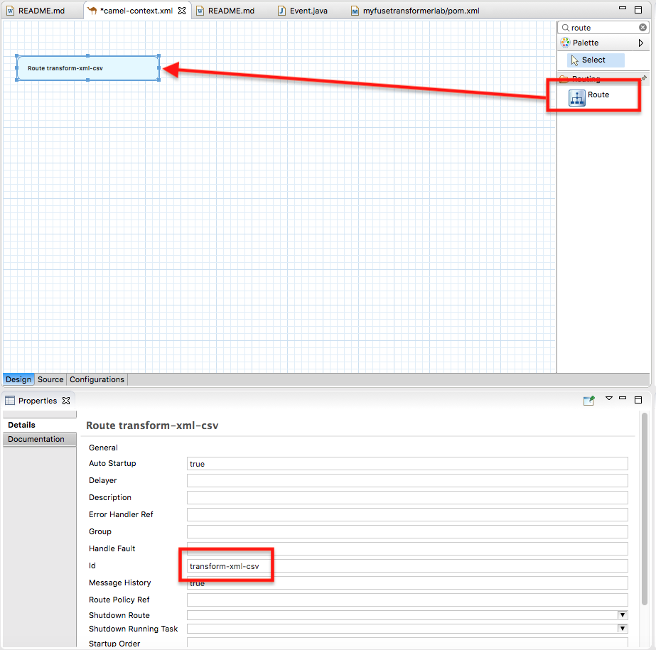

Use the File component to kick start the route, by dragging the **File** component from the *Components* palette on the right, and drag it to the route into the canvas. Under *Uri* , set it to `file:src/data?noop=true`.

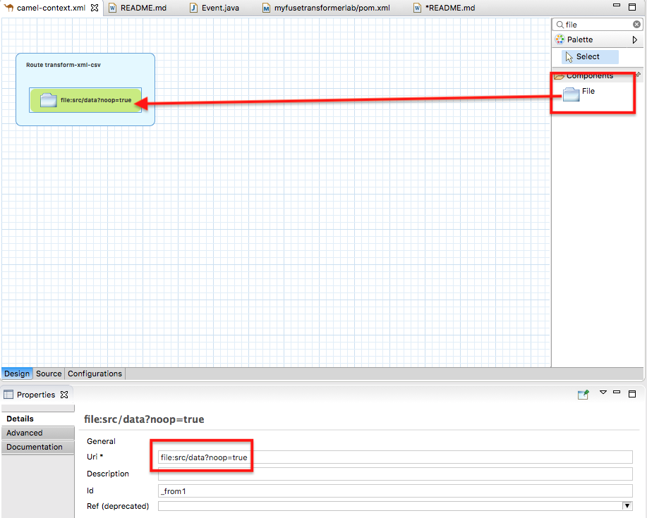

To create our content based router, select **Choice** component from the *Components* palette on the right to the route.  Do the same to create three **When** blocks, plus an **Otherwise** block. Your palette should look like the following: 

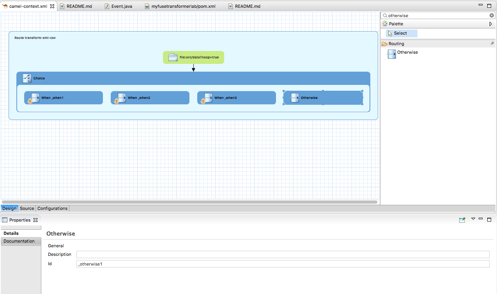

Now we need to give each **When** block an expression.  Select the **When1** block, then select "Xpath" as the "Language" and for the "Expression" copy `/event/@type = 'adjustment'`.  Do the same for **When2** and **When3**, except modify the event type to `receipt` and `cycle-count` respectively.

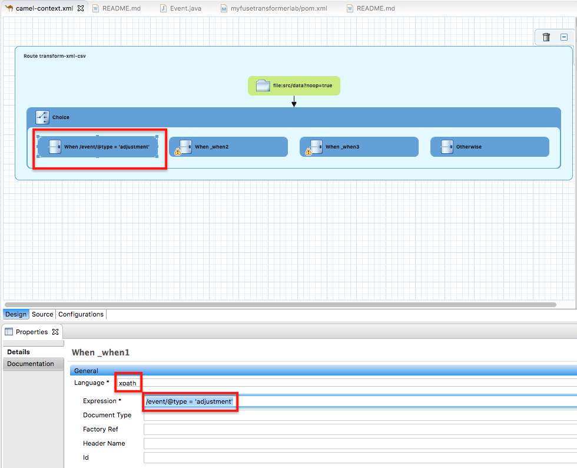

If you've done everything correctly, your choice block should look like this:

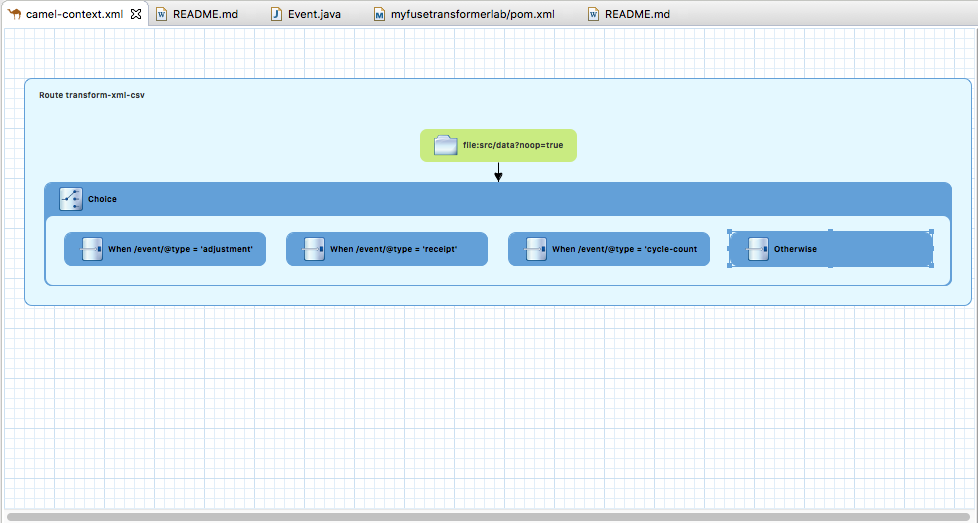

Now we need to add some processing steps to our route.  Firstly, copy the file component over to each **When** and **Otherwise** block.

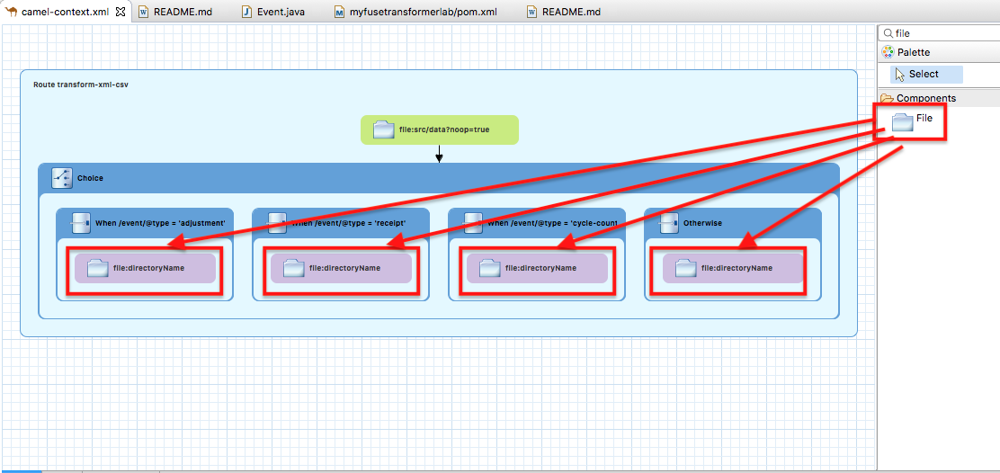

Now, update the "Uri" for each File component (**When1** through **When3** to `file:target/events/adjustments`, `file:target/events/receipts` and `file:target/events/cycle-count?fileName=${file:name.noext}.csv` respectively.  For the **Otherwise** component, set the "Uri" to `file:target/events/others?fileName=${file:name.noext}.txt`.

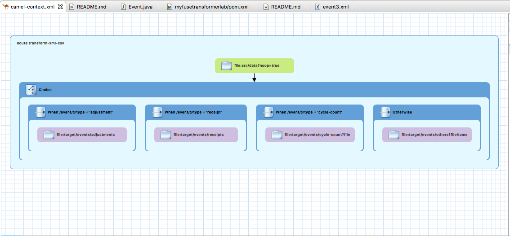

Next up we're going to transform our XML cycle-count file into a CSV file, using the POJO datamodel that we created in Java earlier.  To do this, copy the **Transformer** component to the **When3** box.  A pop-up wizard will appear.  Enter the **Transformation ID** as `EventToCSV`, and select `XML` as the Source Type, then `Java` as the Target Type.  Click "Next".

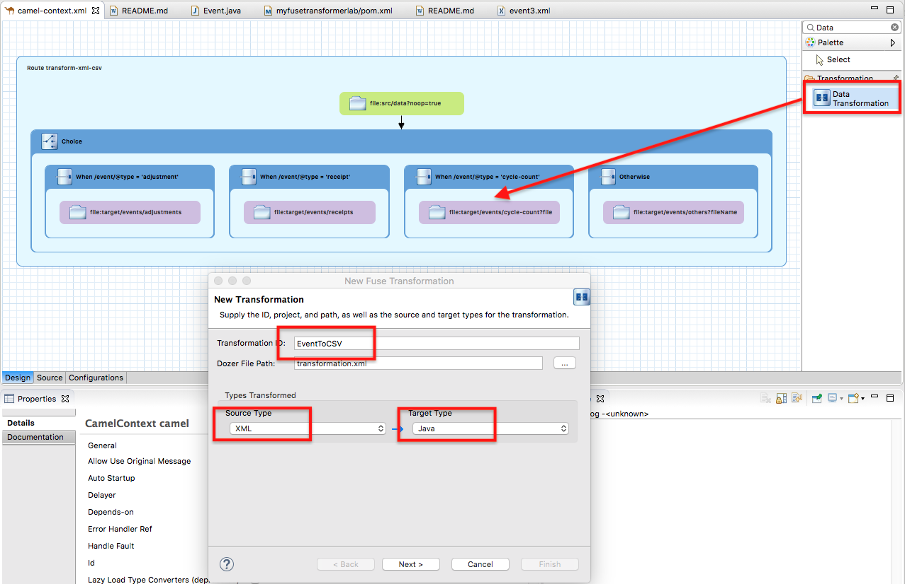

For the Source Type, select "XML Instance Document" then choose the `event1.xml` file as our Source.  Click "Next".


For the Target Type, type in "Event" and select the Event.java class we created earlier.  Click "OK".

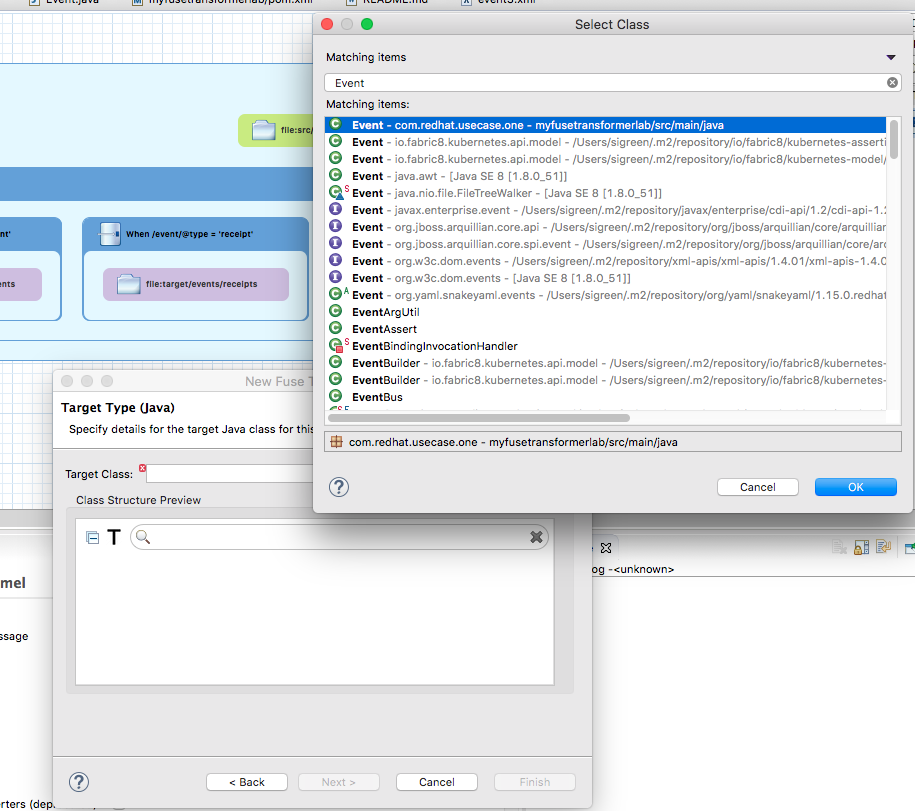

If you've done this correctly, a Transformer Palette window should appear.

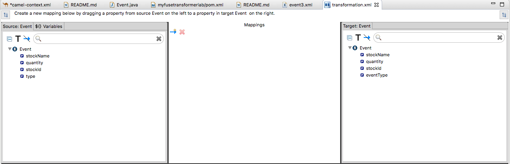

Drag-and-drop each source field to it's corresponding target field i.e. stockName -> stockName, quantity -> quantity, stockId -> stockId and type -> eventType.

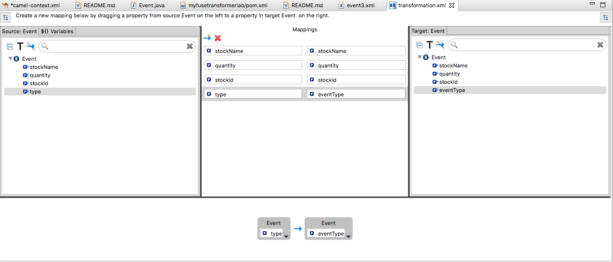

Return to the camel-context.xml file.  Click on the "Configurations" tab, and then click "Add".  Select "bindy-csv" from the drop-down, and give the "ID" name as `bindyDataformat`.  Click "OK".

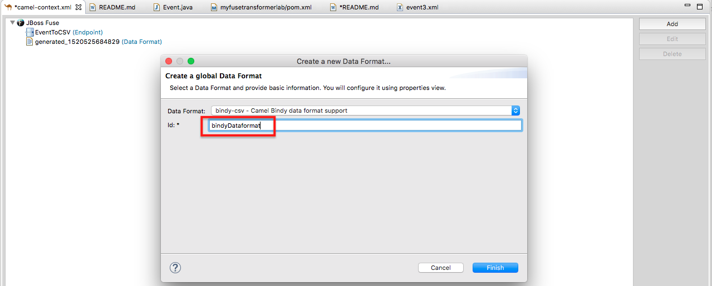

In the properties window, enter the "ClassType" as `com.redhat.usecase.one.Event`.  Save the camel-context.xml file.

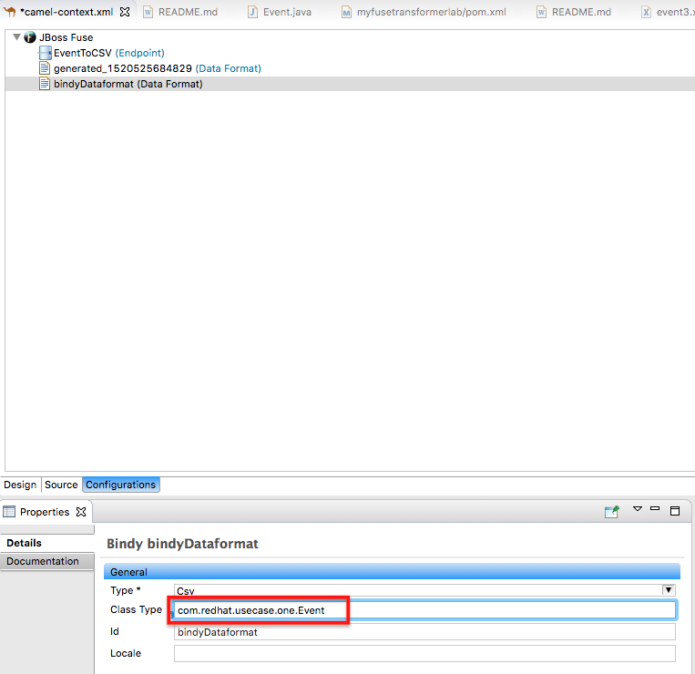

Return to the "Design" tab, and drag-and-drop the Marshal component to the cycle-count **When** block.  Link the steps up.  Select the Marshal component, and set the "ref" field to "bindyDataformat".  Leave the "Data Format Type" field blank.  Save the camel-context.xml file.

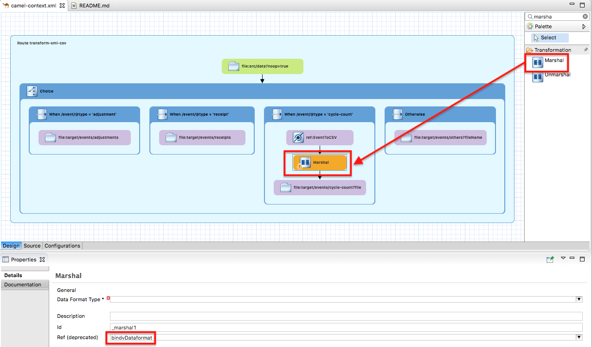

Right click on the **myfusetransformerlab** in the project explorer panel, select **Run As..** -> **Maven build...** 


in the pop-up windown enter **spring-boot:run** in *Goals* and select **Skip Tests**.

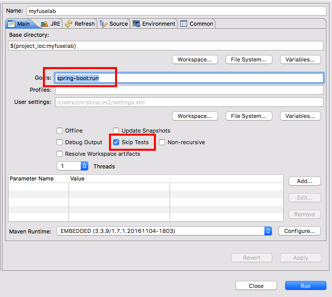

Check the `target/events` directory and verify that your event*.xml files have been routed and transformed to their correct directories.
